## Задача 1

https://hub.docker.com/repository/docker/kirskirill/custom-nginx/general

## Задача 2
    docker run -d -p 127.0.0.1:8080:80 --name KKA-custom-nginx-t2 kirskirill/custom-nginx:1.0.0
    docker ps
    docker rename KKA-custom-nginx-t2 custom-nginx-t2
    docker ps
    date +"%d-%m-%Y %T.%N %Z" ; sleep 0.150 ; docker ps ; ss -tlpn | grep 127.0.0.1:8080  ; docker logs custom-nginx-t2 -n1 ; docker exec -it custom-nginx-t2 base64 /usr/share/nginx/html/index.html

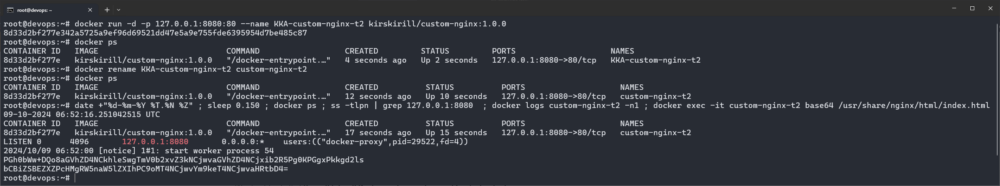

## Задача 3

### Пункты 1-3

    docker attach custom-nginx-t2

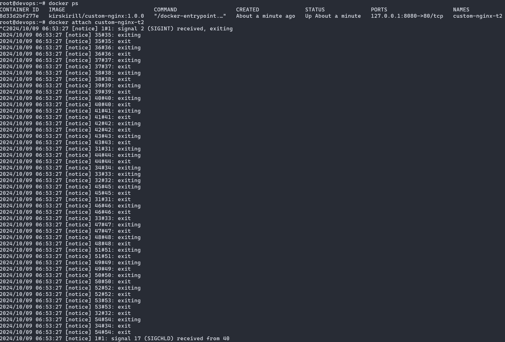

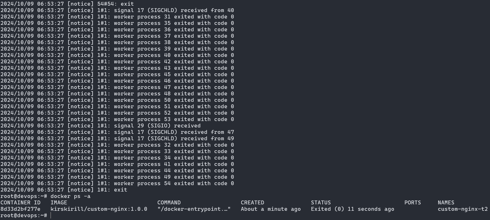

При нажатии Ctrl-C будет послан сигнал прерывания активного процесса nginx, из-за чего и контейнер выключится.

### Пункты 4-10

    docker start custom-nginx-t2
    docker exec -t -i custom-nginx-t2 /bin/bash
    nano /etc/nginx/conf.d/default.conf
    cat /etc/nginx/conf.d/default.conf | grep listen
    nginx -s reload
    curl http://127.0.0.1:80 ; curl http://127.0.0.1:81
    exit
    ss -tlpn | grep 127.0.0.1:8080
    docker port custom-nginx-t2
    curl http://127.0.0.1:8080

При смене прослушиваемого порта nginx нужно так же менять перенаправление портов контейнера на новый (в нашем случае на 81 порт контейнера)

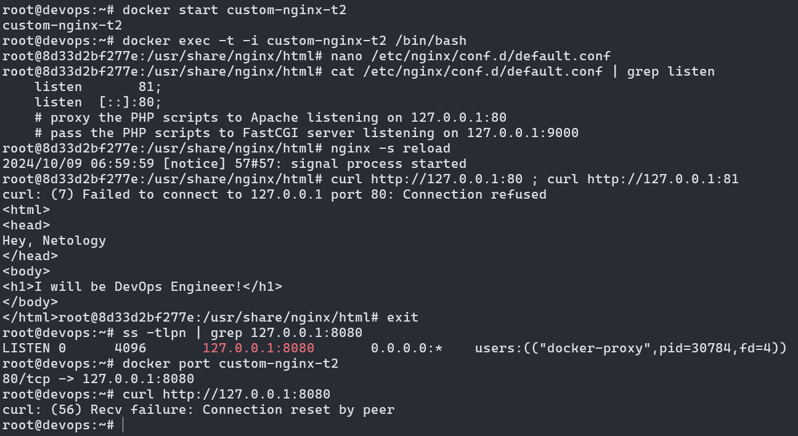

### Пункт 12

    docker ps -a
    docker rm -f custom-nginx-t2
    docker ps -a

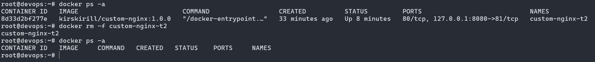

## Задача 4

    pwd ; ls
    docker run -d -i -t -v $(pwd):/data -h centos_container --name centos library/centos bash
    docker run -d -i -t -v $(pwd):/data -h debian_container --name debian library/debian bash
    docker ps
    docker exec -t -i centos /bin/bash
    echo "Test text" > /data/testfile.txt
    cat /data/testfile.txt
    exit
    touch ./testfile2.txt
    docker exec -t -i debian /bin/bash
    ls /data
    cat /data/testfile.txt

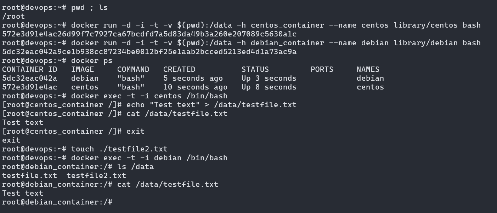

## Задача 5

Т.к. задания выполняются на виртуальной машине и у неё нет GUI, то и `127.0.0.1` в браузере использовать не получится. Будет использован адрес, по которому есть доступ на VM.

### Пункт 1

    mkdir ./task5
    touch ./task5/compose.yaml
    nano ./task5/compose.yaml
    touch ./task5/docker-compose.yaml
    nano ./task5/docker-compose.yaml
    cd ./task5/
    docker compose up -d

`compose.yaml`

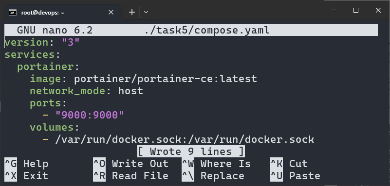

`docker-compose.yaml`

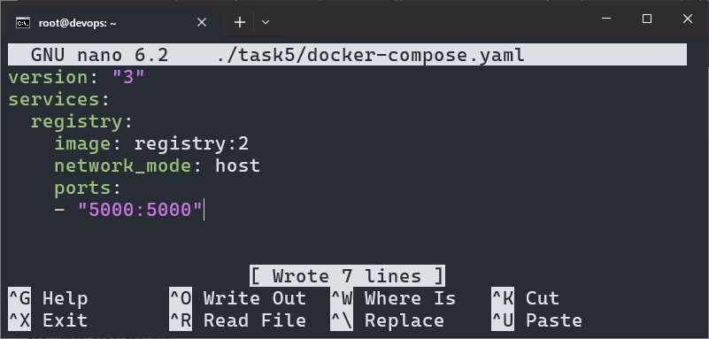

При запуске `docker compose up -d` при существовании нескольких файлов будет выбран `compose.yaml` как предпочтительный.

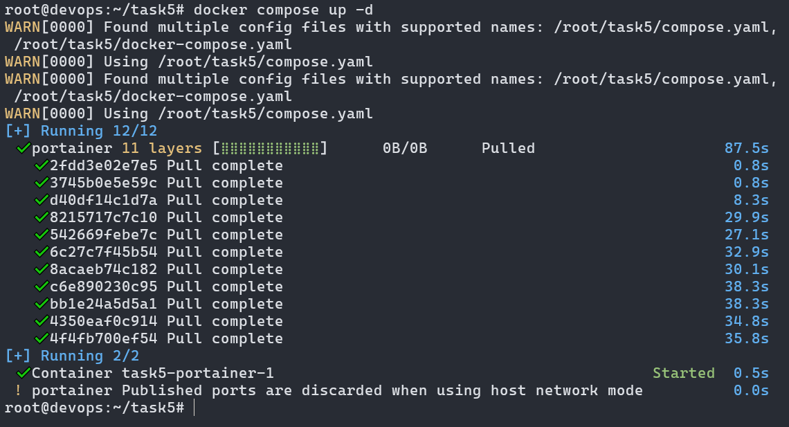

Следует быть внимательным, потому что при использовании команды `docker-compose up -d` будет выбран `docker-compose.yaml`.

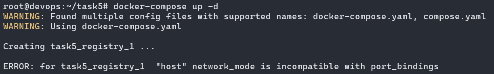

### Пункт 2

`compose.yaml` included `docker-compose.yaml`.

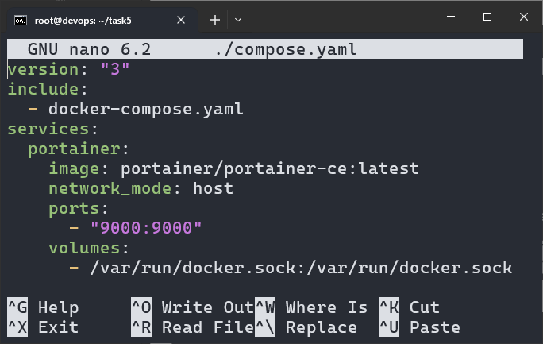

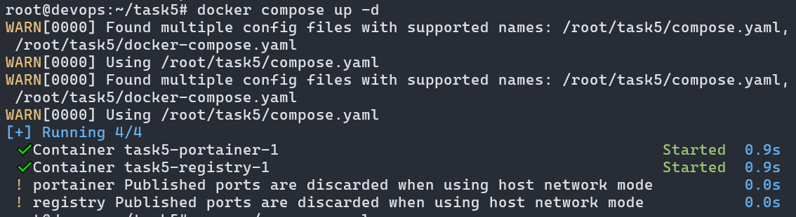

### Пункт 3

    docker tag docker.io/kirskirill/custom-nginx:1.0.0 localhost:5000/custom-nginx:latest
    docker push localhost:5000/custom-nginx:latest

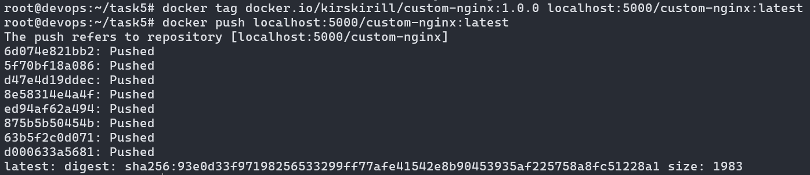

### Пункт 4

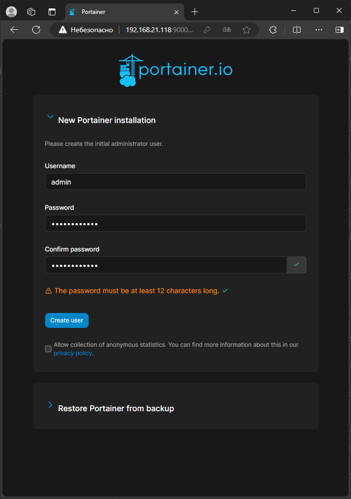

### Пункт 5

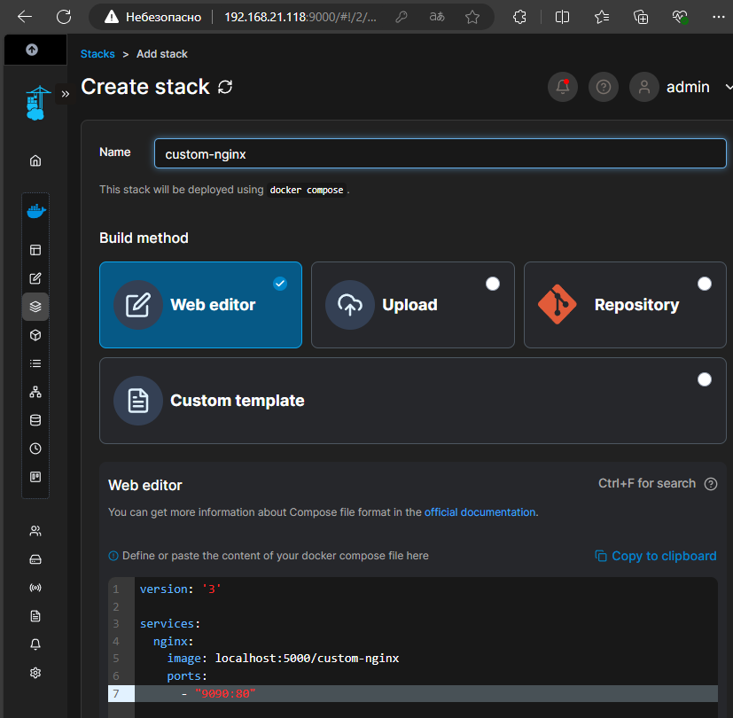

### Пункт 6

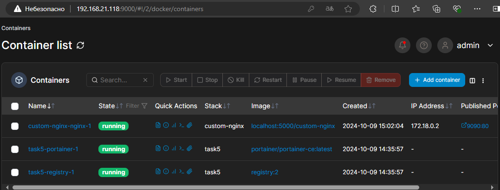

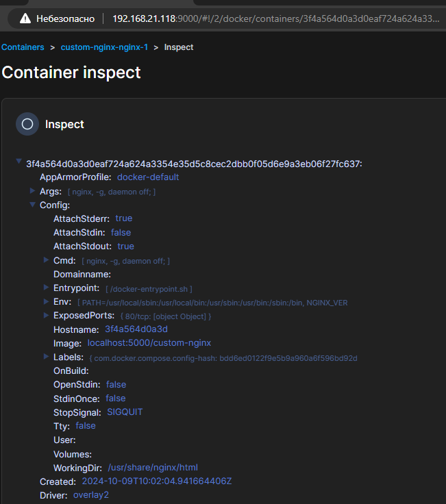

### Пункт 7

    rm ./compose.yaml
    docker compose down --remove-orphans

При удалении compose-файла у существующего стека система предупреждает, что существуют контейнеры, которые остались без описания их работы, поэтому их нужно удалять с ключом `--remove-orphans`, чтобы убрать контейнеры, для которых больше нет описания.

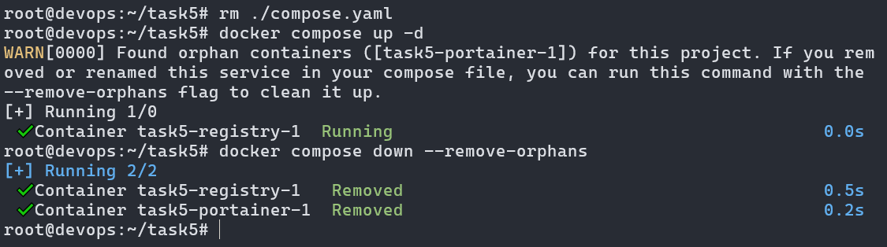