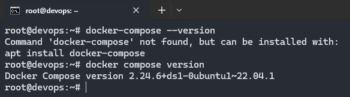
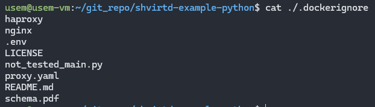

# Домашнее задание к занятию 5. «Практическое применение Docker»

## Задача 0

1. Убедитесь что у вас НЕ(!) установлен ```docker-compose```, для этого получите следующую ошибку от команды ```docker-compose --version```
2. Убедитесь что у вас УСТАНОВЛЕН ```docker compose```(без тире) версии не менее v2.24.X, для это выполните команду ```docker compose version```  



## Задача 1

<https://github.com/kirs-kirill/shvirtd-example-python>

Содержимое `Dockerfile.python`:

    FROM python:3.9-slim
    
    WORKDIR /app
    COPY . .
    RUN pip install --no-cache-dir -r requirements.txt && rm requirements.txt
    
    ENV DB_HOST=127.0.0.1
    ENV DB_USER=app
    ENV DB_PASSWORD=very_strong
    ENV DB_NAME=example
    
    CMD ["sh", "-c", "sleep 5 && python main.py"]
    # слип нужен т.к. почему-то скрипт не ждет пока бд полностью откроется

Содержимое `.dockerignore`


