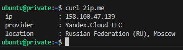

# Домашнее задание к занятию «Организация сети»

### Задание 1. Yandex Cloud 

**Что нужно сделать**

1. Создать пустую VPC. Выбрать зону.
2. Публичная подсеть.

 - Создать в VPC subnet с названием public, сетью 192.168.10.0/24.
 - Создать в этой подсети NAT-инстанс, присвоив ему адрес 192.168.10.254. В качестве image_id использовать fd80mrhj8fl2oe87o4e1.
 - Создать в этой публичной подсети виртуалку с публичным IP, подключиться к ней и убедиться, что есть доступ к интернету.
3. Приватная подсеть.
 - Создать в VPC subnet с названием private, сетью 192.168.20.0/24.
 - Создать route table. Добавить статический маршрут, направляющий весь исходящий трафик private сети в NAT-инстанс.
 - Создать в этой приватной подсети виртуалку с внутренним IP, подключиться к ней через виртуалку, созданную ранее, и убедиться, что есть доступ к интернету.

Resource Terraform для Yandex Cloud:

- [VPC subnet](https://registry.terraform.io/providers/yandex-cloud/yandex/latest/docs/resources/vpc_subnet).
- [Route table](https://registry.terraform.io/providers/yandex-cloud/yandex/latest/docs/resources/vpc_route_table).
- [Compute Instance](https://registry.terraform.io/providers/yandex-cloud/yandex/latest/docs/resources/compute_instance).


#### Решение

[`main.tf`](./terraform/main.tf)

1. Создать пустую VPC. Выбрать зону.
    

    Название сети `hw-15`, зона `ru-central1-a`.
    
    ``` hcl
    # Создаем пустую VPC
    resource "yandex_vpc_network" "hw-net" {
      name = "hw-15"
      folder_id = var.folder_id
    }
    ```

2. Публичная подсеть.
    * Создать в VPC subnet с названием public, сетью 192.168.10.0/24.

    ``` hcl
    # Добавляем подсеть public
    resource "yandex_vpc_subnet" "public" {
      v4_cidr_blocks = var.public_cidr
      zone           = var.default_zone
      network_id     = yandex_vpc_network.hw-net.id
      name           = "public"
    }
    ```

    * Создать в этой подсети NAT-инстанс, присвоив ему адрес 192.168.10.254. В качестве image_id использовать fd80mrhj8fl2oe87o4e1.

    ``` hcl
    resource "yandex_compute_instance" "nat-instance" {
      name        = var.vm_nat_name
      hostname = var.vm_nat_name
      platform_id = "standard-v3"
      zone        = var.default_zone

      resources {
        core_fraction = 20
        cores         = 2
        memory        = 2
      }
      scheduling_policy {
        preemptible = true
      }

      # Используем образ fd80mrhj8fl2oe87o4e1
      boot_disk {
        initialize_params {
          image_id = "fd80mrhj8fl2oe87o4e1"
        }
      }

      # Присвоим адрес 192.168.10.254
      network_interface {
        subnet_id          = yandex_vpc_subnet.public.id
        nat                = false
        ip_address         = "192.168.10.254"
      }

      metadata = {
        serial-port-enable = 1
        ssh-keys = "${var.ssh_user}:${var.ssh_public_key}"
      }

    }
    ```

    * Создать в этой публичной подсети виртуалку с публичным IP, подключиться к ней и убедиться, что есть доступ к интернету.

    ``` hcl
    data "yandex_compute_image" "ubuntu" {
      family = var.vm_web_family
    }

    resource "yandex_compute_instance" "vm" {
      name        = "vm"
      hostname        = "vm"
      platform_id = "standard-v3"
      zone        = var.default_zone

      resources {
        core_fraction = 20
        cores         = 2
        memory        = 2
      }
      scheduling_policy {
        preemptible = true
      }

      boot_disk {
        initialize_params {
          image_id = data.yandex_compute_image.ubuntu.image_id
        }
      }

      network_interface {
        subnet_id          = yandex_vpc_subnet.public.id
        nat                = true
      }

      metadata = {
        ssh-keys = "${var.ssh_user}:${var.ssh_public_key}"
      }
    }

    ```

    Output:
    ``` 
    out = [
      "instance_name: vm",
      [
        "external_ip:  89.169.142.248",
        "internal_ip:  192.168.10.12",
        "zone: ru-central1-a",
        "fqdn: vm.ru-central1.internal",
      ],
      "instance_name:    nat-vm",
      [
        "external_ip:  ",
        "internal_ip:  192.168.10.254",
        "zone: ru-central1-a",
        "fqdn: nat-vm.ru-central1.internal",
      ],
    ]
    ```

    

3. Приватная подсеть.
    * Создать в VPC subnet с названием private, сетью 192.168.20.0/24.
    * Создать route table. Добавить статический маршрут, направляющий весь исходящий трафик private сети в NAT-инстанс.

    ```
    # Добавляем подсеть private
    resource "yandex_vpc_subnet" "private" {
      v4_cidr_blocks = var.private_cidr
      zone           = var.default_zone
      network_id     = yandex_vpc_network.hw-net.id
      name           = "private"
      route_table_id = yandex_vpc_route_table.private_gw.id
    }
    ```
    ```
    resource "yandex_vpc_route_table" "private_gw" {
      network_id = yandex_vpc_network.hw-net.id

      static_route {
        destination_prefix = "0.0.0.0/0"
        next_hop_address   = "192.168.10.254"
      }
    }
    ```

    * Создать в этой приватной подсети виртуалку с внутренним IP, подключиться к ней через виртуалку, созданную ранее, и убедиться, что есть доступ к интернету.

    ```
    Outputs:

    out = [
      "instance_name: public",
      [
        "external_ip:  51.250.80.143",
        "internal_ip:  192.168.10.8",
        "zone: ru-central1-a",
        "fqdn: public.ru-central1.internal",
      ],
      "instance_name: private",
      [
        "external_ip:  ",
        "internal_ip:  192.168.20.8",
        "zone: ru-central1-a",
        "fqdn: private.ru-central1.internal",
      ],
      "instance_name:    nat-vm",
      [
        "external_ip:  158.160.47.139",
        "internal_ip:  192.168.10.254",
        "zone: ru-central1-a",
        "fqdn: nat-vm.ru-central1.internal",
      ],
    ]
    ```

    

    Как видим, публичный адрес приватной ВМ принадлежит NAT-инстансу.
