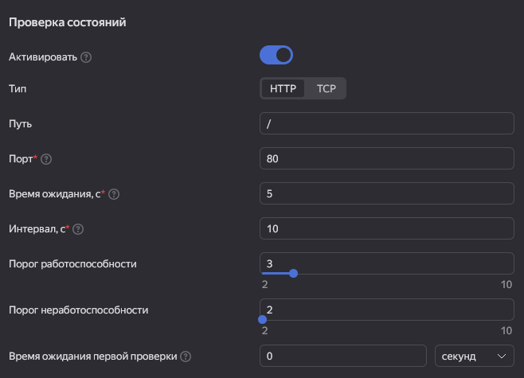

# Домашнее задание к занятию «Вычислительные мощности. Балансировщики нагрузки»  

## Задание 1. Yandex Cloud 

**Что нужно сделать**

1. Создать бакет Object Storage и разместить в нём файл с картинкой:

 - Создать бакет в Object Storage с произвольным именем (например, _имя_студента_дата_).
 - Положить в бакет файл с картинкой.
 - Сделать файл доступным из интернета.
 
2. Создать группу ВМ в public подсети фиксированного размера с шаблоном LAMP и веб-страницей, содержащей ссылку на картинку из бакета:

 - Создать Instance Group с тремя ВМ и шаблоном LAMP. Для LAMP рекомендуется использовать `image_id = fd827b91d99psvq5fjit`.
 - Для создания стартовой веб-страницы рекомендуется использовать раздел `user_data` в [meta_data](https://cloud.yandex.ru/docs/compute/concepts/vm-metadata).
 - Разместить в стартовой веб-странице шаблонной ВМ ссылку на картинку из бакета.
 - Настроить проверку состояния ВМ.
 
3. Подключить группу к сетевому балансировщику:

 - Создать сетевой балансировщик.
 - Проверить работоспособность, удалив одну или несколько ВМ.
4. (дополнительно)* Создать Application Load Balancer с использованием Instance group и проверкой состояния.

Полезные документы:

- [Compute instance group](https://registry.terraform.io/providers/yandex-cloud/yandex/latest/docs/resources/compute_instance_group).
- [Network Load Balancer](https://registry.terraform.io/providers/yandex-cloud/yandex/latest/docs/resources/lb_network_load_balancer).
- [Группа ВМ с сетевым балансировщиком](https://cloud.yandex.ru/docs/compute/operations/instance-groups/create-with-balancer).

#### Решение

[`main.tf`](./terraform/main.tf)

1. ``` tf
    resource "yandex_storage_bucket" "hw_bucket" {
      bucket                = "kirsanov-hw-bucket"
      folder_id             = var.folder_id
      max_size              = 1024000
      default_storage_class = "COLD"
      anonymous_access_flags {
        read        = true
        list        = true
        config_read = true
      }
    }
    resource "yandex_iam_service_account_static_access_key" "sa-static-key" {
      service_account_id = var.service_account_id
      description        = "static access key for object storage"
    }
    resource "yandex_storage_object" "test-object" {
      access_key = yandex_iam_service_account_static_access_key.sa-static-key.access_key
      secret_key = yandex_iam_service_account_static_access_key.sa-static-key.secret_key
      bucket     = yandex_storage_bucket.hw_bucket.bucket
      key        = "1.jpg"
      source     = "./1.jpg"
    }

    ```

    Ссылка на картинку: https://storage.yandexcloud.net/kirsanov-hw-bucket/1.jpg

2.  ```
    resource "yandex_compute_instance_group" "hw-group" {
    folder_id           = var.folder_id
    service_account_id  = var.service_account_id
    deletion_protection = false
    instance_template {
      platform_id = "standard-v1"
      resources {
        memory = 2
        cores  = 2
      }
      boot_disk {
        mode = "READ_WRITE"
        initialize_params {
          image_id = data.yandex_compute_image.lamp.id
          size     = 20
        }
      }
      network_interface {
        nat        = true
        network_id = yandex_vpc_network.hw-net.id
        subnet_ids = ["${yandex_vpc_subnet.public.id}"]
      }
      labels = {
        label1 = "label1-value"
        label2 = "label2-value"
      }
      metadata = {
        user-data = "${file("./data.txt")}" # тут мы правим страничку index.html
        ssh-keys  = "ubuntu:${file("~/.ssh/id_ed25519.pub")}"
      }
      network_settings {
        type = "STANDARD"
      }
    }

    scale_policy {
      fixed_scale {
        size = 3
      }
    }

    allocation_policy {
      zones = ["ru-central1-a"]
    }

    deploy_policy {
      max_unavailable = 2
      max_creating    = 2
      max_expansion   = 2
      max_deleting    = 2
    }
    health_check {            # добавляем проверку состояния машин
      healthy_threshold = 3
      http_options {
        path = "/"
        port = 80
      }
      interval = 10
      timeout = 5
      unhealthy_threshold = 2
    }
    }

  В web-версии проверка состояния по итогу выглядит так:

  

  Файл `data.txt`:

  ``` yaml
  #cloud-config
  runcmd:
  write_files:
    - path: /var/www/html/index.html
      content: |
        <html>
        <body>
          <h1>Welcome to LAMP</h1>
          
        </body>
        </html>
      permissions: '0777'
  runcmd:
    - service apache2 restart
  ```

  

3. В `resource "yandex_compute_instance_group" "hw-group"` добавляем балансировщик:
  ```
  load_balancer {
    target_group_name        = "target-group"
    target_group_description = "Целевая группа Network Load Balancer"
  }
  ```

  И в [`main.tf`](./terraform/main.tf) добавляем сам балансировщик:
  ```
  resource "yandex_lb_network_load_balancer" "hw-loadbalancer" {
    name = "hw-loadbalancer"

    listener {
      name = "hw-loadbalancer-listener"
      port = 80
      external_address_spec {
        ip_version = "ipv4"
      }
    }

    attached_target_group {
      target_group_id = yandex_compute_instance_group.hw-group.load_balancer.0.target_group_id

      healthcheck {
        name = "http"
        http_options {
          port = 80
          path = "/index.html"
        }
      }
    }
  }
  ```

  В web-версии это выглядит так:
  
  

  По IP балансировщика теперь отвечает одна из машин группы:

  

  При ручном удалении машины из группы, тут же создается новая:

  

  А в операциях в балансировщике происходит обновление информации о ресурсах в группе:

  

