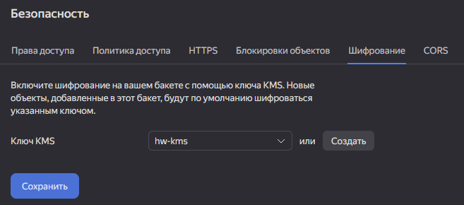
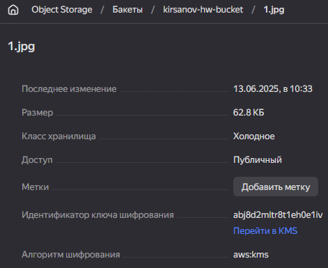
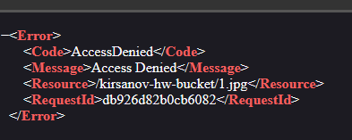

# Домашнее задание к занятию «Безопасность в облачных провайдерах»  

Используя конфигурации, выполненные в рамках предыдущих домашних заданий, нужно добавить возможность шифрования бакета.

---
## Задание 1. Yandex Cloud   

1. С помощью ключа в KMS необходимо зашифровать содержимое бакета:

 - создать ключ в KMS;
 - с помощью ключа зашифровать содержимое бакета, созданного ранее.
2. (Выполняется не в Terraform)* Создать статический сайт в Object Storage c собственным публичным адресом и сделать доступным по HTTPS:

 - создать сертификат;
 - создать статическую страницу в Object Storage и применить сертификат HTTPS;
 - в качестве результата предоставить скриншот на страницу с сертификатом в заголовке (замочек).

Полезные документы:

- [Настройка HTTPS статичного сайта](https://cloud.yandex.ru/docs/storage/operations/hosting/certificate).
- [Object Storage bucket](https://registry.terraform.io/providers/yandex-cloud/yandex/latest/docs/resources/storage_bucket).
- [KMS key](https://registry.terraform.io/providers/yandex-cloud/yandex/latest/docs/resources/kms_symmetric_key).

#### Решение

1.  С помощью ключа в KMS необходимо зашифровать содержимое бакета: 
  * создать ключ в KMS
    ```
    resource "yandex_kms_symmetric_key" "key-a" {
      name              = "hw-kms"
      description       = "hw-kms"
      default_algorithm = "AES_128"
      rotation_period   = "8760h" // equal to 1 year
    }
    ```

  * с помощью ключа зашифровать содержимое бакета, созданного ранее.
    ```
    resource "yandex_storage_bucket" "hw_bucket" {
      bucket                = "kirsanov-hw-bucket"
      folder_id             = var.folder_id
      max_size              = 1024000
      default_storage_class = "COLD"
      anonymous_access_flags {
        read        = true
        list        = true
        config_read = true
      }
      server_side_encryption_configuration {
        rule {
          apply_server_side_encryption_by_default {
            kms_master_key_id = yandex_kms_symmetric_key.key-a.id
            sse_algorithm     = "aws:kms"
          }
        }
      }
    }
    ```

    

    После шифрования с помощью KMS, доступа к изображению больше нет:
    

    

