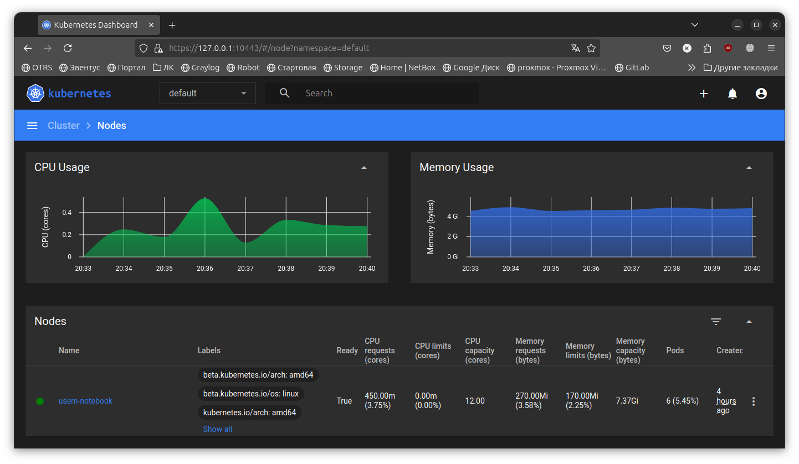

# Домашнее задание к занятию «Kubernetes. Причины появления. Команда kubectl»

### Задание 1. Установка MicroK8S

1. Установить MicroK8S на локальную машину или на удалённую виртуальную машину.
2. Установить dashboard.
3. Сгенерировать сертификат для подключения к внешнему ip-адресу.

#### Ответ

1.      @usem-notebook:~$ microk8s version
        MicroK8s v1.32.1 revision 7665
2.      @usem-notebook:~$ microk8s status
        microk8s is running
        high-availability: no
          datastore master nodes: 127.0.0.1:19001
          datastore standby nodes: none
        addons:
          enabled:
            dashboard            # (core) The Kubernetes dashboard
            dns                  # (core) CoreDNS
            ha-cluster           # (core) Configure high availability on the current node
            helm                 # (core) Helm - the package manager for Kubernetes
            helm3                # (core) Helm 3 - the package manager for Kubernetes
            metrics-server       # (core) K8s Metrics Server for API access to service metrics
3. 
        @usem-notebook:~$ sudo microk8s refresh-certs --cert front-proxy-client.crt
        sudo microk8s refresh-certs --cert front-proxy-client.crt
        Taking a backup of the current certificates under /var/snap/microk8s/7665/certs-backup/
        Creating new certificates
        Signature ok
        subject=CN = front-proxy-client
        Getting CA Private Key
        Restarting service kubelite.

---

### Задание 2. Установка и настройка локального kubectl
1. Установить на локальную машину kubectl.
2. Настроить локально подключение к кластеру.
3. Подключиться к дашборду с помощью port-forward.

#### Ответ

1.      @usem-notebook:~$ kubectl version 
        Client Version: v1.31.0
        Kustomize Version: v5.4.2
        Server Version: v1.32.1

2.      @usem-notebook:~$ microk8s config > ~/.kube/config
        @usem-notebook:~$ kubectl get nodes
        NAME            STATUS   ROLES    AGE   VERSION
        usem-notebook   Ready    <none>   60m   v1.32.1

3. Дождёмся когда все поды поднимутся и выведем дефолтный токен
        
        @usem-notebook:~$ microk8s kubectl describe secret -n kube-system microk8s-dashboard-token
        Name:         microk8s-dashboard-token
        Namespace:    kube-system
        Labels:       <none>
        Annotations:  kubernetes.io/service-account.name: default
                      kubernetes.io/service-account.uid: f7140ed2-e2d2-4176-9550-b09d9994cbf6

        Type:  kubernetes.io/service-account-token

    Пробрасываем порты

        @usem-notebook:~$ microk8s kubectl port-forward -n kube-system service/kubernetes-dashboard 10443:443
        Forwarding from 127.0.0.1:10443 -> 8443
        Forwarding from [::1]:10443 -> 8443

    