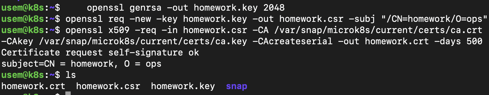
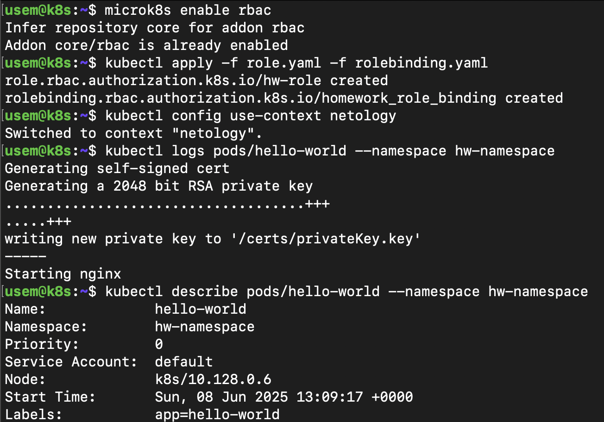

# Домашнее задание к занятию «Управление доступом»

### Цель задания

В тестовой среде Kubernetes нужно предоставить ограниченный доступ пользователю.

-----

### Инструменты / дополнительные материалы, которые пригодятся для выполнения задания

1. [Описание](https://kubernetes.io/docs/reference/access-authn-authz/rbac/) RBAC.
2. [Пользователи и авторизация RBAC в Kubernetes](https://habr.com/ru/company/flant/blog/470503/).
3. [RBAC with Kubernetes in Minikube](https://medium.com/@HoussemDellai/rbac-with-kubernetes-in-minikube-4deed658ea7b).

------

### Задание 1. Создайте конфигурацию для подключения пользователя

1. Создайте и подпишите SSL-сертификат для подключения к кластеру.
2. Настройте конфигурационный файл kubectl для подключения.
3. Создайте роли и все необходимые настройки для пользователя.
4. Предусмотрите права пользователя. Пользователь может просматривать логи подов и их конфигурацию (`kubectl logs pod <pod_id>`, `kubectl describe pod <pod_id>`).
5. Предоставьте манифесты и скриншоты и/или вывод необходимых команд.


#### Решение

0. Пользователь `homework`, namespace `hw-namespace`.
1. ``` sh
    openssl genrsa -out homework.key 2048 # Создаем ключ `homework.key`
    openssl req -new -key homework.key -out homework.csr -subj "/CN=homework/O=ops" # Создаем запрос сертификата `homework.csr`
    openssl x509 -req -in homework.csr -CA /var/snap/microk8s/current/certs/ca.crt -CAkey /var/snap/microk8s/current/certs/ca.key -CAcreateserial -out homework.crt -days 500 # создаем самоподписанный сертификат `homework.crt`
    ```
    
2. `kubectl config set-context netology --cluster=microk8s-cluster --user=homework` - создаем контекст с пользователем на кластере.
    ``` sh
    usem@k8s:~$ kubectl config set-context netology --cluster=microk8s-cluster --user=homework
    Context "netology" created.
    ```
3. `microk8s enable rbac` - активируем RBAC.

    [`role.yaml`](role.yaml) - создаем роль с правами пользователя.

    [`rolebinding.yaml`](./rolebinding.yaml) - назначаем пользователю `homework` права из созданной роли.
    
    

------

