# Домашнее задание к занятию 1 «Введение в Ansible»

[Ссылка на задание](https://github.com/netology-code/mnt-homeworks/tree/MNT-video/08-ansible-01-base)

### Основная часть

1. Попробуйте запустить playbook на окружении из `test.yml`, зафиксируйте значение, которое имеет факт `some_fact` для указанного хоста при выполнении playbook.

    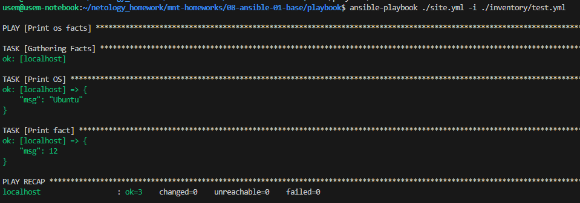

    `ansible-playbook ./site.yml -i ./inventory/test.yml` запускается без ошибок.

    `some_fact` имеет значение 12.

2. Найдите файл с переменными (group_vars), в котором задаётся найденное в первом пункте значение, и поменяйте его на `all default fact`.

    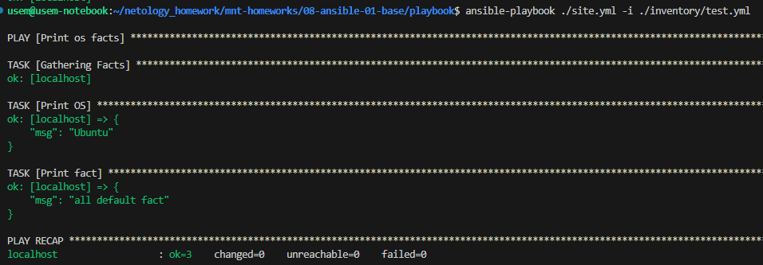

    При изменении значения переменной в `group_vars/all/examp.yml` меняется и вывод команды.

3. Воспользуйтесь подготовленным (используется `docker`) или создайте собственное окружение для проведения дальнейших испытаний.

    Буду использовать готовое.

    ```
    docker run --name centos7 -id pycontribs/centos:7
    docker run --name ubuntu -id pycontribs/ubuntu
    ```

    

4. Проведите запуск playbook на окружении из `prod.yml`. Зафиксируйте полученные значения `some_fact` для каждого из `managed host`.

    `ansible-playbook ./site.yml -i ./inventory/prod.yml`

    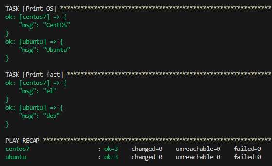

5. Добавьте факты в `group_vars` каждой из групп хостов так, чтобы для `some_fact` получились значения: для `deb` — `deb default fact`, для `el` — `el default fact`.

    Не совсем понял задание: если нужно только добавить переменные, а менять `some_fact` нельзя, то каким образом значение вывода должно измениться?

    Добавил переменные и изменил `some_fact` так, чтобы удовлетворяло выводу условия.

    Для примера, содержимое `group_vars/deb/examp.yml`:
    ```
    ---
      some_fact: "{{ default_fact }} default fact"
      default_fact: "deb"
    ```

6. Повторите запуск playbook на окружении `prod.yml`. Убедитесь, что выдаются корректные значения для всех хостов.

    `ansible-playbook ./site.yml -i ./inventory/prod.yml`

    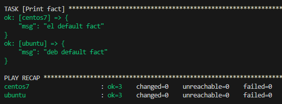

7. При помощи `ansible-vault` зашифруйте факты в `group_vars/deb` и `group_vars/el` с паролем `netology`.

    `ansible-vault encrypt ./group_vars/deb/examp.yml` и `ansible-vault encrypt ./group_vars/el/examp.yml` 

    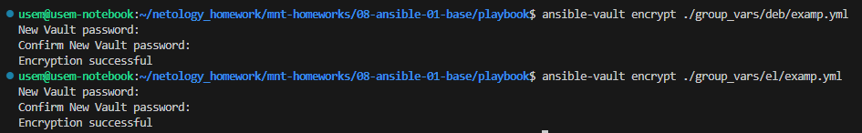

    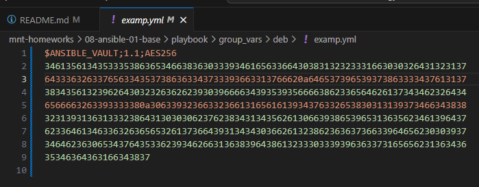
    
    Успешно зашифровалось

8. Запустите playbook на окружении `prod.yml`. При запуске `ansible` должен запросить у вас пароль. Убедитесь в работоспособности.

    `ansible-playbook ./site.yml -i ./inventory/prod.yml --ask-vault-pass`

    Запросило пароль и успешно выполнилось

    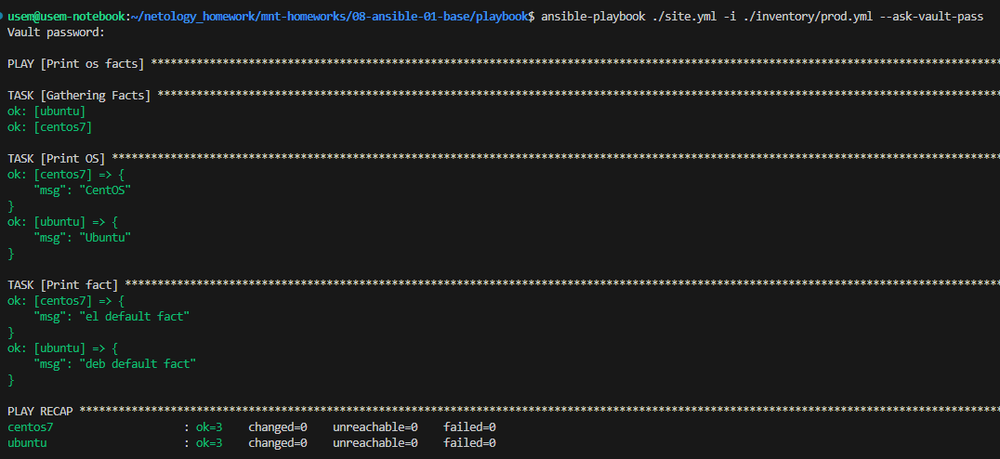

9. Посмотрите при помощи `ansible-doc` список плагинов для подключения. Выберите подходящий для работы на `control node`.

    `ansible-doc -t connection -l`

    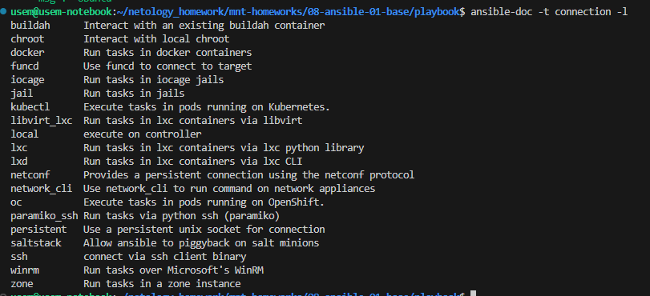

10. В `prod.yml` добавьте новую группу хостов с именем  `local`, в ней разместите localhost с необходимым типом подключения.

    ```
    cat ./inventory/prod.yml                              
    ---
      el:
        hosts:
          centos7:
            ansible_connection: docker
      deb:
        hosts:
          ubuntu:
            ansible_connection: docker
      local:
            hosts:
              localhost:
                ansible_connection: local
    ```

11. Запустите playbook на окружении `prod.yml`. При запуске `ansible` должен запросить у вас пароль. Убедитесь, что факты `some_fact` для каждого из хостов определены из верных `group_vars`.

    `ansible-playbook ./site.yml -i ./inventory/prod.yml --ask-vault-pass`

    

12. Заполните `README.md` ответами на вопросы. Сделайте `git push` в ветку `master`. В ответе отправьте ссылку на ваш открытый репозиторий с изменённым `playbook` и заполненным `README.md`.

13. Предоставьте скриншоты результатов запуска команд.


### Необязательная часть

1. При помощи `ansible-vault` расшифруйте все зашифрованные файлы с переменными.

    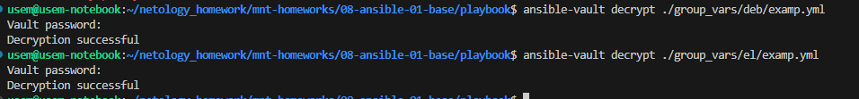

2. Зашифруйте отдельное значение `PaSSw0rd` для переменной `some_fact` паролем `netology`. Добавьте полученное значение в `group_vars/all/exmp.yml`.

    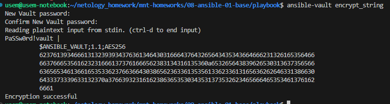

    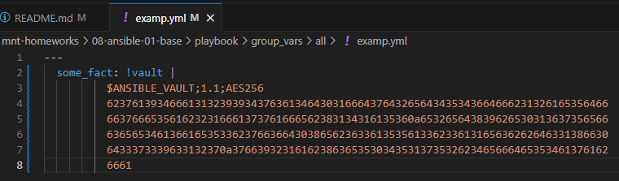

3. Запустите `playbook`, убедитесь, что для нужных хостов применился новый `fact`.

    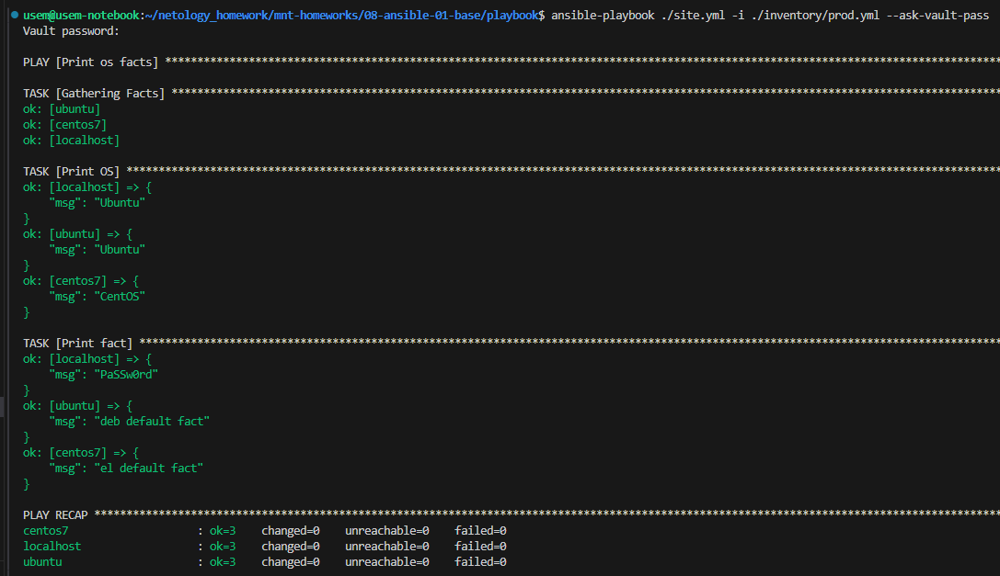

4. Добавьте новую группу хостов `fedora`, самостоятельно придумайте для неё переменную. В качестве образа можно использовать [этот вариант](https://hub.docker.com/r/pycontribs/fedora).

    При использовании рекомендованного образа ansible выдавал ошибку, в образе нет необходимого файла `/usr/bin/python`, только `/usr/bin/python3`.

    Используется образ [`lansible/fedora`](https://hub.docker.com/r/lansible/fedora)

    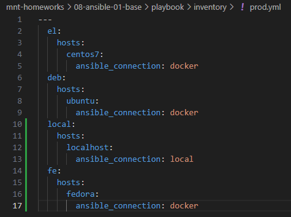

    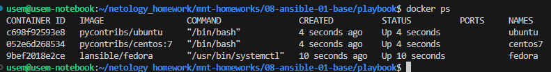
  
5. Напишите скрипт на bash: автоматизируйте поднятие необходимых контейнеров, запуск ansible-playbook и остановку контейнеров.

    [`script.sh`](./playbook/script.sh)

    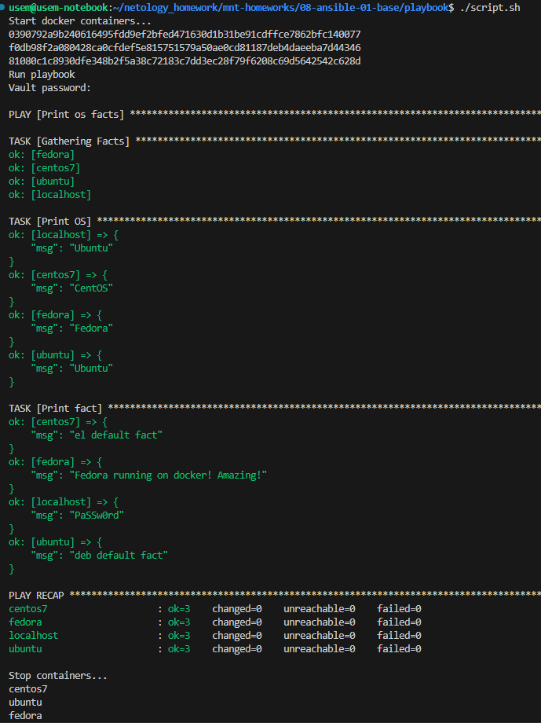

6. Все изменения должны быть зафиксированы и отправлены в ваш личный репозиторий.
