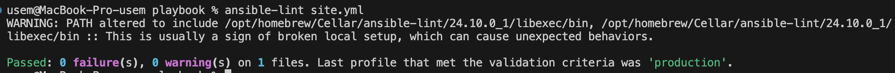
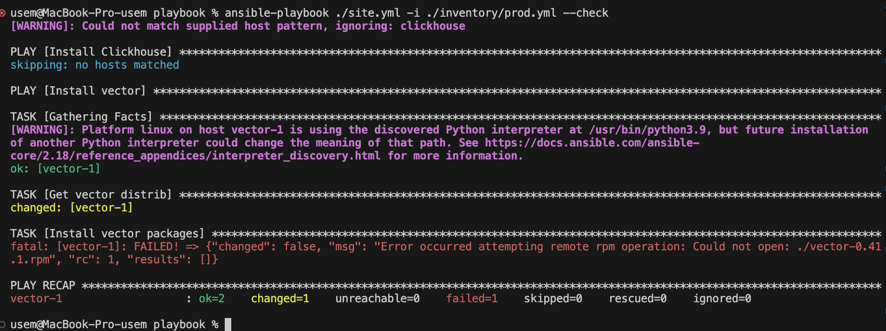
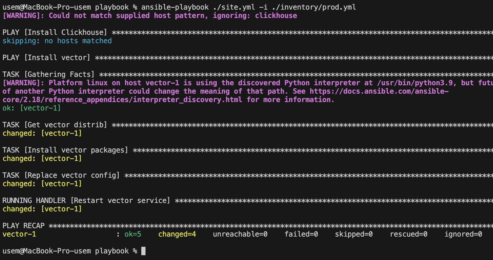
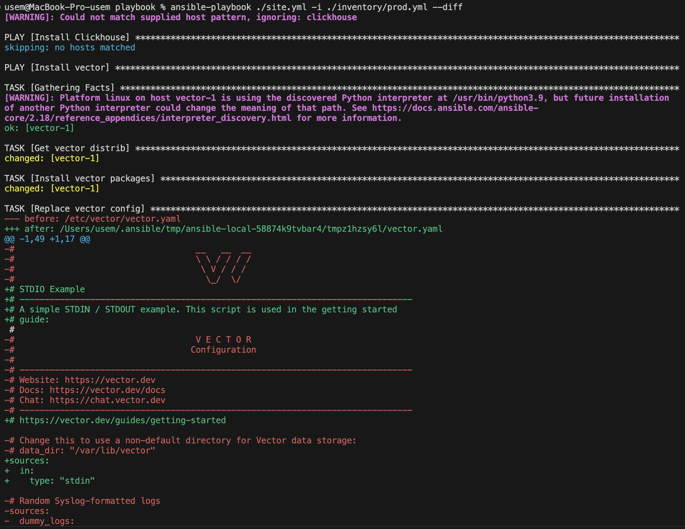
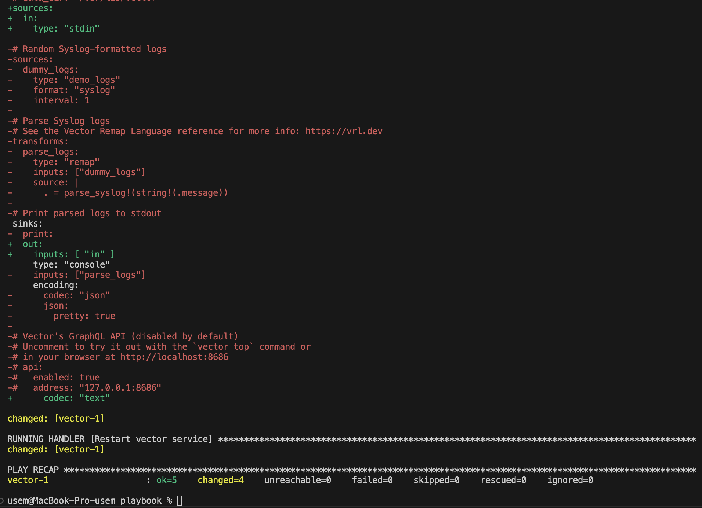
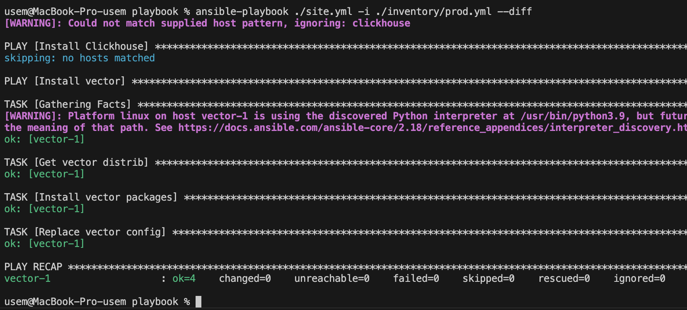

# Домашнее задание к занятию 2 «Работа с Playbook»

## Подготовка к выполнению

1. * Необязательно. Изучите, что такое [ClickHouse](https://www.youtube.com/watch?v=fjTNS2zkeBs) и [Vector](https://www.youtube.com/watch?v=CgEhyffisLY).
2. Создайте свой публичный репозиторий на GitHub с произвольным именем или используйте старый.
3. Скачайте [Playbook](./playbook/) из репозитория с домашним заданием и перенесите его в свой репозиторий.
4. Подготовьте хосты в соответствии с группами из предподготовленного playbook.

## Основная часть

1. inventory-файл [`prod.yml`](./playbook/inventory/prod.yml). Пароль стандартный из прошлого задания.
2. Шаблон ['vector.yaml](./playbook/templates/vector.yaml). Шаблон самый минимальный для работоспособности, поэтому возможности Jinja2 не используются. 
3. [x] При создании tasks рекомендую использовать модули: `get_url`, `template`, `unarchive`, `file`.
4. [x] Tasks должны: скачать дистрибутив нужной версии, выполнить распаковку в выбранную директорию, установить vector.
5. Запустите `ansible-lint site.yml` и исправьте ошибки, если они есть.
    
    
    
6. Попробуйте запустить playbook на этом окружении с флагом `--check`.

    

    Выдало ошибку, т.к. нужный пакет не скачался и таска не смогла с ним работать.

    

7. Запустите playbook на `prod.yml` окружении с флагом `--diff`. Убедитесь, что изменения на системе произведены.

    

    

8. Повторно запустите playbook с флагом `--diff` и убедитесь, что playbook идемпотентен.

    

9. Подготовьте README.md-файл по своему playbook. В нём должно быть описано: что делает playbook, какие у него есть параметры и теги. Пример качественной документации ansible playbook по [ссылке](https://github.com/opensearch-project/ansible-playbook). Так же приложите скриншоты выполнения заданий №5-8
10. Готовый playbook выложите в свой репозиторий, поставьте тег `08-ansible-02-playbook` на фиксирующий коммит, в ответ предоставьте ссылку на него.

    [Ссылка на коммит](https://github.com/kirs-kirill/netology_homework/commit/23ca2b3eb09c22220f670ef1b064fb816d5edd97)

---

### Как оформить решение задания

Выполненное домашнее задание пришлите в виде ссылки на .md-файл в вашем репозитории.

---
