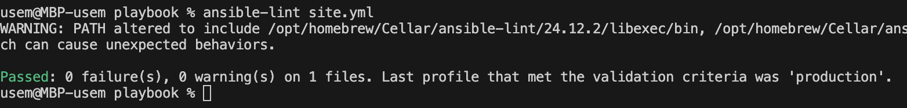
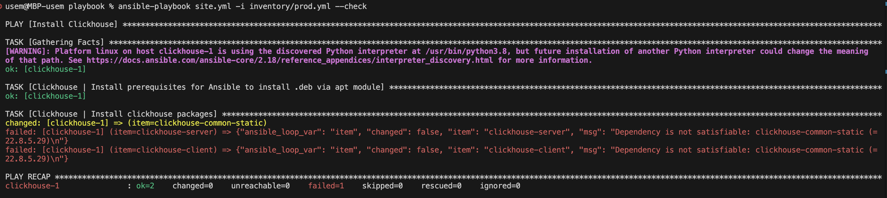
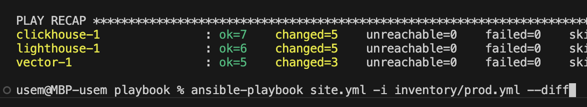
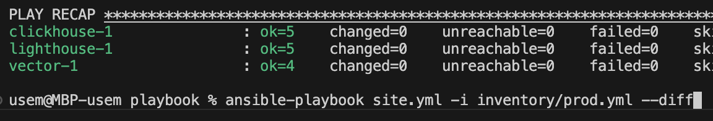

# Домашнее задание к занятию 3 «Использование Ansible»

# Домашнее задание к занятию "8.4 Работа с Roles"

Данный плейбук предназначен для установки `Clickhouse`, `Vector` и `Lighthouse` на хосты, указанные в `inventory` файле.

## group_vars

| Переменная  | Назначение  |
|:---|:---|
| `clickhouse_version` | версия `Clickhouse` |
| `clickhouse_packages` | список пакетов для установки `Clickhouse` |
| `vector_clickhouse_ip` | IP адрес инстанса `Clickhouse` для настройки конфига `Vector` |
| `vector_packages` | список пакетов для установки `Vector` |

## Inventory файл

Группа "clickhouse" состоит из 1 хоста `clickhouse-01`

Группа "vector" состоит из 1 хоста `vector-01`

Группа "vector" состоит из 1 хоста `lighthouse-01`

## Playbook

Используются 3 `play`:

1. Install Clickhouse

    * `Pre-task`: Установить пакеты для работы .deb модуля ansible.builtin.apt
    * `Clickhouse | Install clickhouse packages`
    * `Clickhouse | Copy config`
    * `Clickhouse | Start clickhouse service`
    * `Clickhouse | Create db`
    * `Clickhouse | create table`

2. Install vector

    * `Pre-task`: Установить пакеты для работы .deb модуля ansible.builtin.apt
    * `Vector | Install vector packages`
    * `Vector | Upload vector config`
    * `Vector | Restart vector service`

3. Install Lighthouse
   
    * `Pre-task`: Установить git и nginx
    * `Lighthouse | Download lighthouse`
    * `Lighthouse | Upload config`
    * `Lighthouse | Start nginx`

## How it works

Playbook состоит из 3 `play`.

Play "Install Clickhouse" применяется на группу хостов "Clickhouse" и предназначен для установки и запуска `Clickhouse`

Данный `play` производит скачивание и установку указанных версий пакетов `clickhouse-common-static`, `clickhouse-server` и `clickhouse-client` из репозитория, копирование конфига на сервер, запуск сервиса `clickhouse-service`, создание БД `logs` с таблицей `access_logs`.

---

Play "Install Vector" применяется на группу хостов "Vector" и предназначен для установки и запуска `Vector`

Данный `play` производит скачивание и установку указанных версий пакетов `vector` из репозитория, копирование конфига с параметрами для подключения к Clickhouse на сервер и запуск сервиса `vector`

---

Play "Install lighthouse" применяется на группу хостов "lighthouse" и предназначен для установки и запуска `lighthouse`

Устанавливаем `GIT` и `NGINX`.

| Имя pretask | Описание |
|--------------|---------|
| `Lighthouse \| Install git` | Устанавливаем `git` |
| `Lighhouse \| Install nginx` | Устанавливаем `Nginx` |

После этого клонируем репозиторий `Lighthouse`, загружаем и применяем конфиг для `nginx`.

## Template

Шаблон "nginx.j2" используется для настройки `nginx`. Мы задаем каталог с файлами `Lighthouse` для работы `nginx`.

Шаблон "clickhouse.xml" указывает параметры сервера и устанавливает прослушивание `clickhouse-server` со всех адресов.

Шалон "vector.j2" устанавливает файл `/var/log/auth.log` в качестве источника логов и указывает сервер `clickhouse` в качестве хранилища.

    
Скриншоты выполнения команд

`ansible-lint` ошибок не выдает.

`--check` не может идти дальше без установки необходимых пакетов.

Все задачи вы playbook выполняются без ошибок.

Playbook идемпотентен

