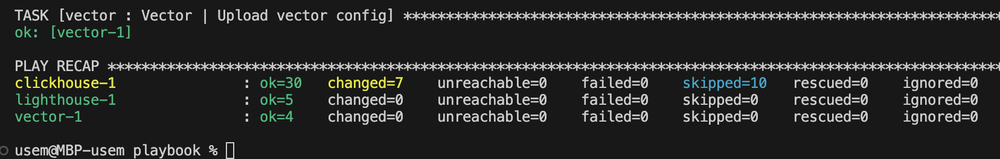
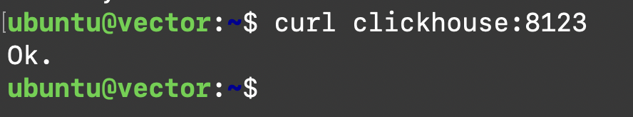

# Домашнее задание к занятию 4 «Работа с roles»

[Ссылка на задание](https://github.com/netology-code/mnt-homeworks/tree/MNT-video/08-ansible-04-role)

[`lighthouse-role`](https://github.com/kirs-kirill/lighthouse-role)

[`vector-role`](https://github.com/kirs-kirill/vector-role)

### Содержимое requirements.yml

    ---
      - src: git@github.com:AlexeySetevoi/ansible-clickhouse.git
        scm: git
        version: "1.13"
        name: clickhouse 

      - src: git@github.com:kirs-kirill/vector-role.git
        scm: git
        version: "1.0.0"
        name: vector 

      - src: git@github.com:kirs-kirill/lighthouse-role.git
        scm: git
        version: "1.0.0"
        name: lighthouse 

Содержимое playbook.yml

    ---
    - name: clickhouse
      hosts: clickhouse
      become: true
      vars:
        clickhouse_listen_host_custom:
          - "{{ hostvars['clickhouse-1']['ansible_eth0']['ipv4']['address'] }}"
      roles:
        - clickhouse

    - name: Clickhouse_DB
      hosts: clickhouse
      tasks:
        - name: Clickhouse | Create db
          # Create db, clickhouse-service may start quickly, need retries and delays
          ansible.builtin.command: "clickhouse-client -q 'CREATE DATABASE IF NOT EXISTS logs;'"
          register: create_db
          retries: 5
          delay: 5
          failed_when: create_db.rc != 0 and create_db.rc != 82
          changed_when: create_db.rc == 0

        - name: Clickhouse | create table
          # Create table in DB
          ansible.builtin.command: "clickhouse-client -q 'CREATE TABLE IF NOT EXISTS  logs.access_logs (message String) ENGINE = MergeTree() ORDER BY tuple()'"
          register: create_table
          changed_when: create_table.rc == 0

    - name: Lighthouse
      hosts: lighthouse
      become: true
      roles: 
        - lighthouse

    - name: Install vector
      hosts: vector
      become: true
      vars:
        clickhouse_host: "{{ hostvars['clickhouse-1']['ansible_eth0']['ipv4']['address'] }}"
      roles:
        - vector

Скриншоты запуска

