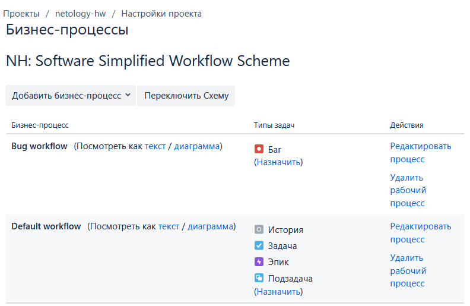
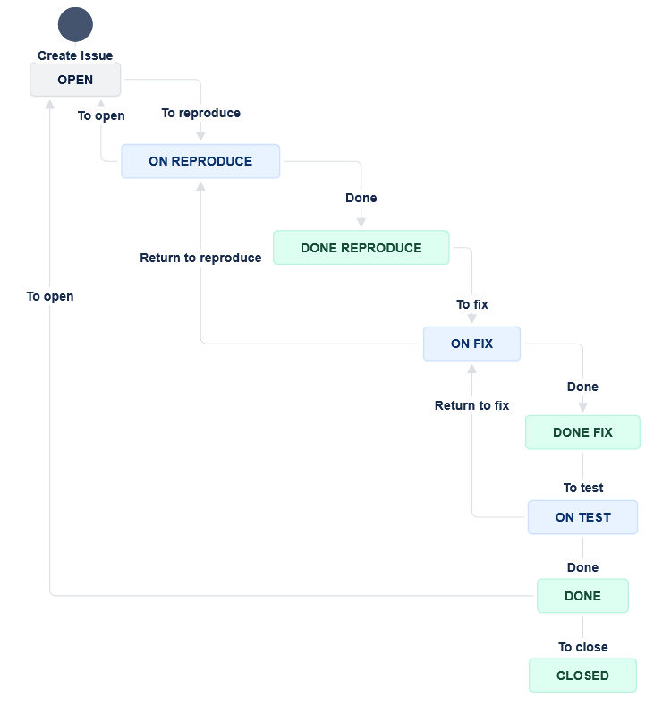
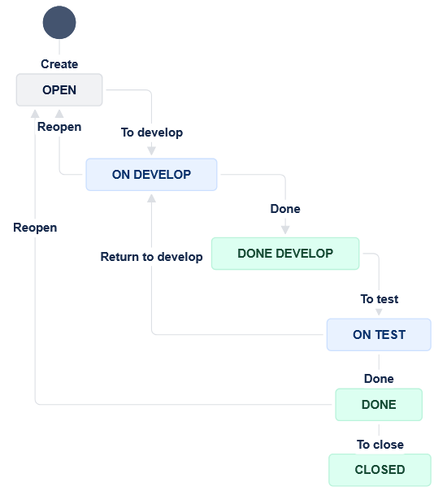

# Домашнее задание к занятию 7 «Жизненный цикл ПО»

## Основная часть

Необходимо создать собственные workflow для двух типов задач: bug и остальные типы задач. 



Задачи типа bug должны проходить жизненный цикл:
```jira
Open -> On reproduce.
On reproduce -> Open, Done reproduce.
Done reproduce -> On fix.
On fix -> On reproduce, Done fix.
Done fix -> On test.
On test -> On fix, Done.
Done -> Closed, Open.
```

[Bug_workflow.xml](./files/Bug_workflow.xml)

<details>
<summary>Bug workflow screenshot</summary>



</details>

Остальные задачи должны проходить по упрощённому workflow:
```jira
Open -> On develop.
On develop -> Open, Done develop.
Done develop -> On test.
On test -> On develop, Done.
Done -> Closed, Open.
```
[Default_workflow.xml](./files/Default_workflow.xml)

<details>
<summary>Default workflow screenshot</summary>



</details>
