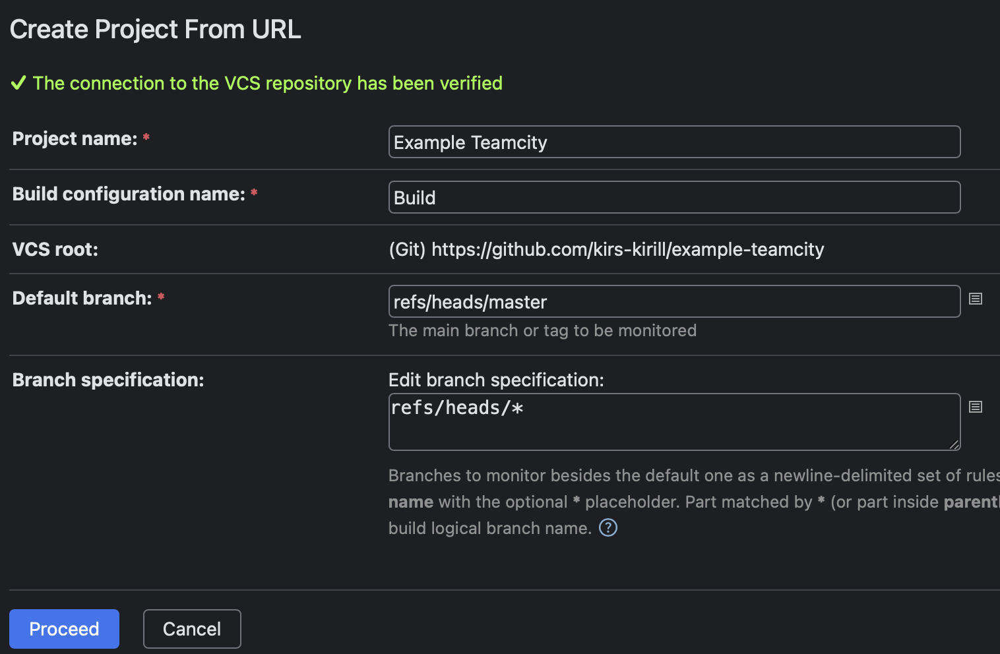
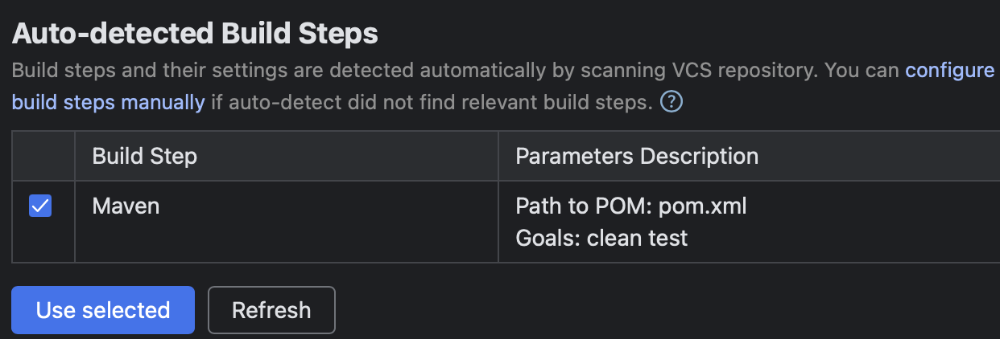
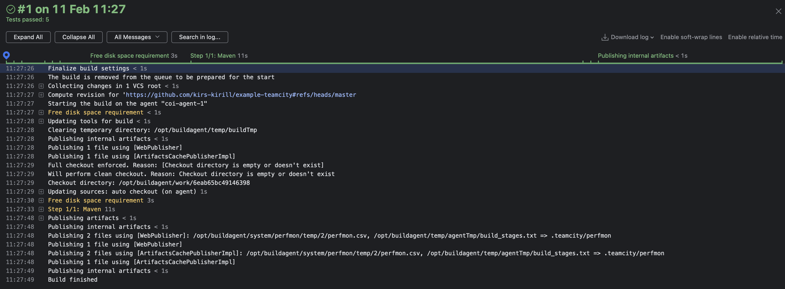
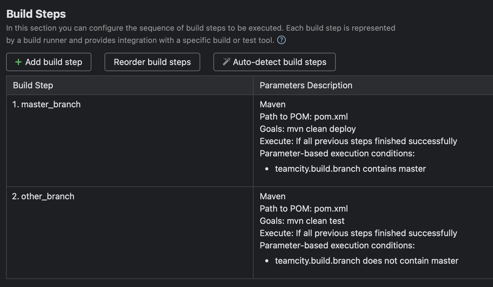
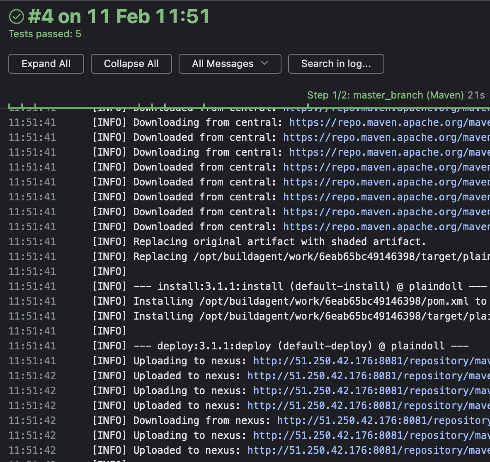
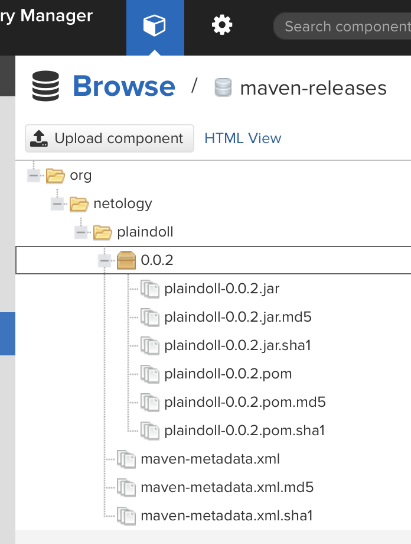

# Домашнее задание к занятию 11 «Teamcity»

1. 

    
Создайте новый проект в teamcity на основе fork

    

    

2. 

    
Сделайте autodetect конфигурации.

    

    

3. 

    
Сохраните необходимые шаги, запустите первую сборку master.

    Сборка выполнена успешно.

    

    

4. 

    
Поменяйте условия сборки: если сборка по ветке <code>master</code>, то должен происходит <code>mvn clean deploy</code>, иначе <code>mvn clean test</code>.

    

    

5. [x] Для deploy будет необходимо загрузить [settings.xml](./teamcity/settings.xml) в набор конфигураций maven у teamcity, предварительно записав туда креды для подключения к nexus.
6. [x] В pom.xml необходимо поменять ссылки на репозиторий и nexus.
7. 

    
Запустите сборку по master, убедитесь, что всё прошло успешно и артефакт появился в nexus.

    
    По ветке мастер сборка прошла успешно и артефакты нормально загрузились в нексус.
    
    
    
    
    

