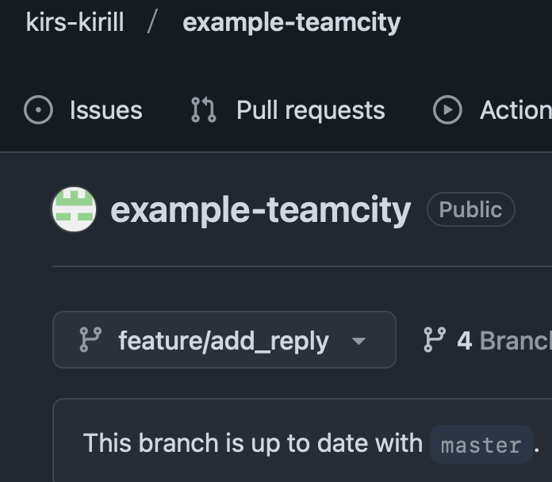

# Домашнее задание к занятию 11 «Teamcity»

1. 

    
Создайте новый проект в teamcity на основе fork

    

    

2. 

    
Сделайте autodetect конфигурации.

    

    

3. 

    
Сохраните необходимые шаги, запустите первую сборку master.

    Сборка выполнена успешно.

    

    

4. 

    
Поменяйте условия сборки: если сборка по ветке <code>master</code>, то должен происходит <code>mvn clean deploy</code>, иначе <code>mvn clean test</code>.

    

    

5. Для deploy будет необходимо загрузить `settings.xml` в набор конфигураций maven у teamcity, предварительно записав туда креды для подключения к nexus.

6. В `pom.xml` необходимо поменять ссылки на репозиторий и nexus.
7. 

    
Запустите сборку по master, убедитесь, что всё прошло успешно и артефакт появился в nexus.

    По ветке мастер сборка прошла успешно и артефакты нормально загрузились в нексус.
    

    

    

8. 

    
Мигрируйте <code>build configuration</code> в репозиторий.

    По ветке мастер сборка прошла успешно и артефакты нормально загрузились в нексус.
    

    

    

9. 

    
Создайте отдельную ветку <code>feature/add_reply</code> в репозитории.

    

    

10. 

    
Напишите новый метод для класса Welcomer: метод должен возвращать произвольную реплику, содержащую слово <code>hunter</code>.

    

    

11. 

    
Дополните тест для нового метода на поиск слова <code>hunter</code> в новой реплике.

    

    

12. 

    
Сделайте push всех изменений в новую ветку репозитория.

    

    

13. 

    
Убедитесь, что сборка самостоятельно запустилась, тесты прошли успешно.

    

    

14. 

    
Внесите изменения из произвольной ветки <code>feature/add_reply</code> в <code>master</code> через <code>Merge</code>.

    

    

15. 

    
Убедитесь, что нет собранного артефакта в сборке по ветке <code>master</code>.

    

    

16. 

    
Настройте конфигурацию так, чтобы она собирала <code>.jar</code> в артефакты сборки.

    

    

17. 

    
Проведите повторную сборку мастера, убедитесь, что сбора прошла успешно и артефакты собраны.

    

    

18. 

    
Проверьте, что конфигурация в репозитории содержит все настройки конфигурации из teamcity.

    

    

