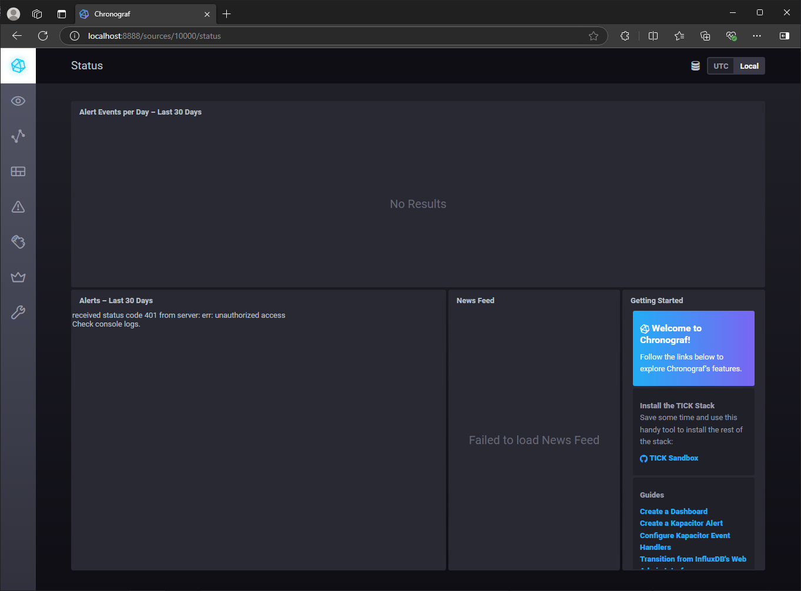
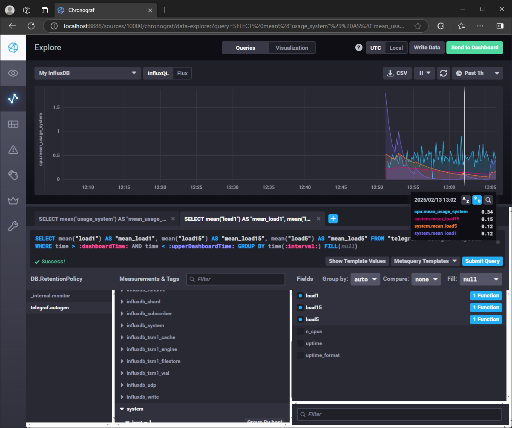

# Домашнее задание к занятию "13.Системы мониторинга"

## Обязательные задания

1. Вас пригласили настроить мониторинг на проект. На онбординге вам рассказали, что проект представляет из себя платформу для вычислений с выдачей текстовых отчетов, которые сохраняются на диск. Взаимодействие с платформой осуществляется по протоколу http. Также вам отметили, что вычисления загружают ЦПУ. Какой минимальный набор метрик вывыведите в мониторинг и почему?

`Ответ`: 

Метрики системы:
- `CPU`:
  - `CPU utilization` - текущая загрузка процессора
  - `CPU LA` - средняя загрузка процессора
- `RAM`: 
  - `Memory utilization` - использование оперативной памяти
  - `Swap` - использование файла подкачки
- `Disk`:
  - `Used space` - использованное место на дисках
  - `IOPS` - чтение/запись диска
  - `Used inodes` - дескрипторы
- `Network`:
  - `Bits received/transmitted` - загрузка сетевых интерфейсов

Метрики приложения:
- `HTTP-запросы`:
  - Общее количество запросов
  - Количество ошибочных запросов (4xx, 5xx)
  - Время выполнения запроса


#
2. Менеджер продукта посмотрев на ваши метрики сказал, что ему непонятно что такое RAM/inodes/CPUla. Также он сказал, 
что хочет понимать, насколько мы выполняем свои обязанности перед клиентами и какое качество обслуживания. Что вы 
можете ему предложить?

`Ответ`: 

- `RAM` - исопльзование оперативной памяти.
- `inodes` - индексные дескрипторы. Их нехватка приведет к ошибке создания файла.
- `CPU LA` - средняя загрузка процессора.

Объясним менеджеру на его языке. Свяжем тех. метрики с бизнес-составляющей: SLO SLA SLI.

- `SLA` - Если клиент не получил ожидаемый ответ от приложения, то значит бизнес бизнес несет убытки. Гарантируем, что ожидаемый ответ от приложения составляет не более 5 секунд.

- `SLO` - Если мы заявляем, что 99% пользователей получат в нужный срок ожидаемый ответ от приложения. 1% - техническое обслуживание.

- `SLI` : Расчет по ответу от приложения клиенту.
*Успех*: Запрос должен отдавать 200ые или 300ые коды в течение 5 секунд.
*Неудача*: нарушение любого условия (ответ или время)

      SLI = (summ_2xx_requests_less_than_5_sec + summ_3xx_requests_less_than_5_sec) / (summ_all_requests)


#
3. Вашей DevOps команде в этом году не выделили финансирование на построение системы сбора логов. Разработчики в свою 
очередь хотят видеть все ошибки, которые выдают их приложения. Какое решение вы можете предпринять в этой ситуации, 
чтобы разработчики получали ошибки приложения?

`Ответ`: 

В таком случае, раз разработчики хотят видеть ошибки, то они должны реализовать в приложении систему файлового логирования.
Можно предложить построить бюджетные схемы сбора логов:

- Можно реализовать на бесплатном по OpenSearch и Sentry
- Текстовые логи можно хранить на сетевом диске (samba, self-hosted cloud)
- Скрипт, который по расписанию парсит логи на наличие ошибок и отправляет их на почту или в мессенджеры.


#
4. Вы, как опытный SRE, сделали мониторинг, куда вывели отображения выполнения SLA=99% по http кодам ответов. 
Вычисляете этот параметр по следующей формуле: summ_2xx_requests/summ_all_requests. Данный параметр не поднимается выше 
70%, но при этом в вашей системе нет кодов ответа 5xx и 4xx. Где у вас ошибка?

`Ответ`: 

Ошибка в формуле, в ней не учитываются коды 3xx.
Правильная формулы выглядит так: `(summ_2xx_requests + summ_3xx_requests) / summ_all_requests`

#
5. Опишите основные плюсы и минусы pull и push систем мониторинга.

`Ответ`: 

- Push
  - Плюсы:
    - Удобно использовать когда собирается большое количество метрик и неустойчивый канал связи между агентами и системой мониторинга.
    - Можно переключать передачу данных между udp и tcp, тем самым выбирая между трафика или гарантией доставки.
    - Гибкая настройка частоты и объёма передаваемых метрик.
    - Можно использовать в динамически меняющемся окружении. (метрики с агентов сами поступать в систему мониторинга без её дополнительной настройки)
- Pull
  - Плюсы:
    - Позволяет контролировать источники откуда принимать метрики.
    - Можно защитить канал связи между агентами и системой мониторинга шифрованием.
    - Упрощённая отладка получения метрик с агентов.
  - Минусы:
    - К минусам можно отнести сложность мониторинга динамически изменяющегося окружения

#
6. Какие из ниже перечисленных систем относятся к push модели, а какие к pull? А может есть гибридные?

    - Prometheus 
    - TICK
    - Zabbix
    - VictoriaMetrics
    - Nagios

`Ответ`: 

 - **Prometheus** - Можно отправлять метрики по `push` модели при помощи `push gateway`, но Prometheus будет из забирать как `pull`
 - **TICK** - `push`
 - **Zabbix** - Оба варианта `push` и `pull`
 - **VictoriaMetrics** - `push`
 - **Nagios** - `pull`

#
7. Склонируйте себе [репозиторий](https://github.com/influxdata/sandbox/tree/master) и запустите TICK-стэк, 
используя технологии docker и docker-compose.

В виде решения на это упражнение приведите скриншот веб-интерфейса ПО chronograf (`http://localhost:8888`). 

P.S.: если при запуске некоторые контейнеры будут падать с ошибкой - проставьте им режим `Z`, например
`./data:/var/lib:Z`

<details>
<summary>скриншот веб-интерфейса ПО chronograf</summary>



</details>

#
8. Перейдите в веб-интерфейс Chronograf (http://localhost:8888) и откройте вкладку Data explorer.
        
    - Нажмите на кнопку Add a query
    - Изучите вывод интерфейса и выберите БД telegraf.autogen
    - В `measurments` выберите cpu->host->telegraf-getting-started, а в `fields` выберите usage_system. Внизу появится график утилизации cpu.
    - Вверху вы можете увидеть запрос, аналогичный SQL-синтаксису. Поэкспериментируйте с запросом, попробуйте изменить группировку и интервал наблюдений.

Для выполнения задания приведите скриншот с отображением метрик утилизации cpu из веб-интерфейса.

<details>
<summary>скриншот с отображением метрик утилизации cpu из веб-интерфейса</summary>



</details>

#
9. Изучите список [telegraf inputs](https://github.com/influxdata/telegraf/tree/master/plugins/inputs). 
Добавьте в конфигурацию telegraf следующий плагин - [docker](https://github.com/influxdata/telegraf/tree/master/plugins/inputs/docker):
```
[[inputs.docker]]
  endpoint = "unix:///var/run/docker.sock"
```

Дополнительно вам может потребоваться донастройка контейнера telegraf в `docker-compose.yml` дополнительного volume и 
режима privileged:
```
  telegraf:
    image: telegraf:1.4.0
    privileged: true
    volumes:
      - ./etc/telegraf.conf:/etc/telegraf/telegraf.conf:Z
      - /var/run/docker.sock:/var/run/docker.sock:Z
    links:
      - influxdb
    ports:
      - "8092:8092/udp"
      - "8094:8094"
      - "8125:8125/udp"
```

После настройке перезапустите telegraf, обновите веб интерфейс и приведите скриншотом список `measurments` в 
веб-интерфейсе базы telegraf.autogen . Там должны появиться метрики, связанные с docker.

Факультативно можете изучить какие метрики собирает telegraf после выполнения данного задания.

<details>
<summary>скриншот с отображением метрик</summary>


</details>