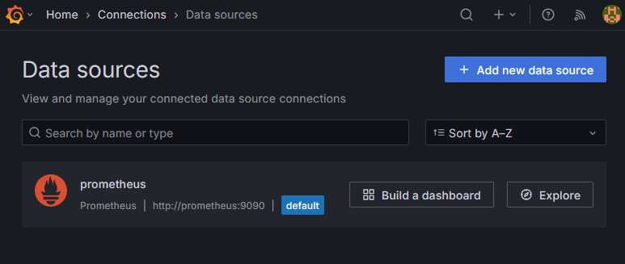
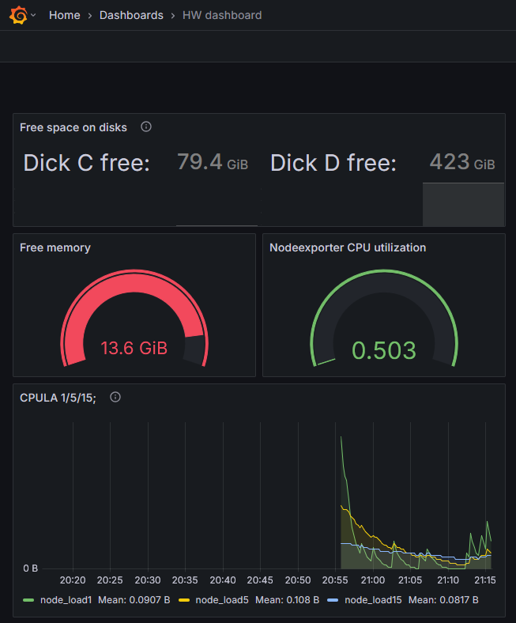
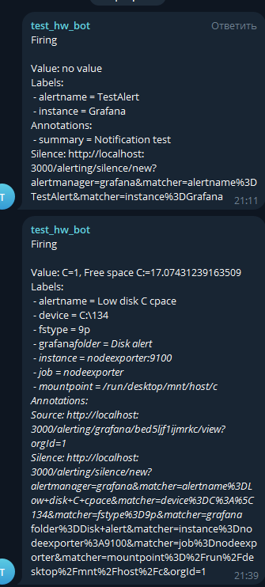

# Домашнее задание к занятию 14 «Средство визуализации Grafana»

## Обязательные задания

Использовал `docker-compose.yaml` из папки `help`, только поправил версию Grafana на свежую.

### Задание 1



## Задание 2



Promql-запросы для выдачи этих метрик:
- утилизация CPU для nodeexporter (в процентах, 100-idle):

    `100-(avg by (instance) (rate(node_cpu_seconds_total{job="nodeexporter",mode="idle"}[1m])) * 100)`

- CPULA 1/5/15:

    Тут используется 3 метрики:
    - `node_load1`
    - `node_load5`
    - `node_load15`

- количество свободной оперативной памяти:

    `node_memory_MemFree_bytes`

- количество места на файловой системе:

    - `node_filesystem_free_bytes{device="C:\\134"}`
    - `node_filesystem_free_bytes{device="D:\\134"}`


## Задание 3

Сделал алерт в Telegram если на диске С: меньше 20% свободного места.




## Задание 4

<details>
<summary>
Содержимое  <a href="./HW_dashboard.json"><code>HW_dashboard.json</code></a>
</summary>

```
{
    "annotations": {
      "list": [
        {
          "builtIn": 1,
          "datasource": {
            "type": "datasource",
            "uid": "grafana"
          },
          "enable": true,
          "hide": true,
          "iconColor": "rgba(0, 211, 255, 1)",
          "name": "Annotations & Alerts",
          "type": "dashboard"
        }
      ]
    },
    "description": "Dashboard for homework",
    "editable": true,
    "fiscalYearStartMonth": 0,
    "graphTooltip": 0,
    "id": 1,
    "links": [],
    "panels": [
      {
        "datasource": {
          "type": "prometheus",
          "uid": "eed5hzxzmkg00e"
        },
        "description": "Free space on disks",
        "fieldConfig": {
          "defaults": {
            "color": {
              "mode": "thresholds"
            },
            "mappings": [],
            "thresholds": {
              "mode": "absolute",
              "steps": []
            },
            "unit": "bytes"
          },
          "overrides": []
        },
        "gridPos": {
          "h": 4,
          "w": 8,
          "x": 0,
          "y": 0
        },
        "id": 8,
        "options": {
          "colorMode": "value",
          "graphMode": "area",
          "justifyMode": "auto",
          "orientation": "auto",
          "percentChangeColorMode": "standard",
          "reduceOptions": {
            "calcs": [
              "lastNotNull"
            ],
            "fields": "",
            "values": false
          },
          "showPercentChange": false,
          "text": {},
          "textMode": "value_and_name",
          "wideLayout": true
        },
        "pluginVersion": "11.5.1",
        "targets": [
          {
            "datasource": {
              "type": "prometheus",
              "uid": "eed5hzxzmkg00e"
            },
            "editorMode": "code",
            "exemplar": false,
            "expr": "node_filesystem_free_bytes{device=\"C:\\\\134\"}",
            "format": "time_series",
            "instant": false,
            "legendFormat": "Dick C free:",
            "range": true,
            "refId": "Dick C:"
          },
          {
            "datasource": {
              "type": "prometheus",
              "uid": "eed5hzxzmkg00e"
            },
            "editorMode": "code",
            "expr": "node_filesystem_free_bytes{device=\"D:\\\\134\"}",
            "hide": false,
            "instant": false,
            "legendFormat": "Dick D free:",
            "range": true,
            "refId": "Dick D:"
          }
        ],
        "title": "Free space on disks",
        "type": "stat"
      },
      {
        "datasource": {
          "type": "prometheus",
          "uid": "eed5hzxzmkg00e"
        },
        "fieldConfig": {
          "defaults": {
            "color": {
              "mode": "thresholds"
            },
            "mappings": [],
            "thresholds": {
              "mode": "absolute",
              "steps": [
                {
                  "color": "green",
                  "value": null
                },
                {
                  "color": "red",
                  "value": 80
                }
              ]
            },
            "unit": "bytes"
          },
          "overrides": []
        },
        "gridPos": {
          "h": 5,
          "w": 4,
          "x": 0,
          "y": 4
        },
        "id": 6,
        "options": {
          "minVizHeight": 75,
          "minVizWidth": 75,
          "orientation": "auto",
          "reduceOptions": {
            "calcs": [
              "lastNotNull"
            ],
            "fields": "",
            "values": false
          },
          "showThresholdLabels": false,
          "showThresholdMarkers": true,
          "sizing": "auto",
          "text": {}
        },
        "pluginVersion": "11.5.1",
        "targets": [
          {
            "datasource": {
              "type": "prometheus",
              "uid": "eed5hzxzmkg00e"
            },
            "editorMode": "code",
            "expr": "node_memory_MemFree_bytes",
            "instant": false,
            "legendFormat": "__auto",
            "range": true,
            "refId": "A"
          }
        ],
        "title": "Free memory",
        "type": "gauge"
      },
      {
        "datasource": {
          "type": "prometheus",
          "uid": "eed5hzxzmkg00e"
        },
        "description": "",
        "fieldConfig": {
          "defaults": {
            "color": {
              "mode": "thresholds"
            },
            "mappings": [],
            "thresholds": {
              "mode": "absolute",
              "steps": [
                {
                  "color": "green",
                  "value": null
                },
                {
                  "color": "red",
                  "value": 80
                }
              ]
            }
          },
          "overrides": []
        },
        "gridPos": {
          "h": 5,
          "w": 4,
          "x": 4,
          "y": 4
        },
        "id": 4,
        "options": {
          "minVizHeight": 75,
          "minVizWidth": 75,
          "orientation": "auto",
          "reduceOptions": {
            "calcs": [
              "lastNotNull"
            ],
            "fields": "",
            "values": false
          },
          "showThresholdLabels": false,
          "showThresholdMarkers": true,
          "sizing": "auto",
          "text": {}
        },
        "pluginVersion": "11.5.1",
        "targets": [
          {
            "datasource": {
              "type": "prometheus",
              "uid": "eed5hzxzmkg00e"
            },
            "editorMode": "code",
            "expr": "100-(avg by (instance) (rate(node_cpu_seconds_total{job=\"nodeexporter\",mode=\"idle\"}[1m])) * 100)",
            "instant": false,
            "legendFormat": "__auto",
            "range": true,
            "refId": "A"
          }
        ],
        "title": "Nodeexporter CPU utilization",
        "type": "gauge"
      },
      {
        "datasource": {
          "type": "prometheus",
          "uid": "eed5hzxzmkg00e"
        },
        "description": "CPU load avg 1/5/15;",
        "fieldConfig": {
          "defaults": {
            "color": {
              "mode": "palette-classic"
            },
            "custom": {
              "axisBorderShow": false,
              "axisCenteredZero": false,
              "axisColorMode": "text",
              "axisLabel": "",
              "axisPlacement": "auto",
              "barAlignment": 0,
              "barWidthFactor": 0.6,
              "drawStyle": "line",
              "fillOpacity": 10,
              "gradientMode": "none",
              "hideFrom": {
                "legend": false,
                "tooltip": false,
                "viz": false
              },
              "insertNulls": false,
              "lineInterpolation": "linear",
              "lineWidth": 1,
              "pointSize": 5,
              "scaleDistribution": {
                "type": "linear"
              },
              "showPoints": "never",
              "spanNulls": false,
              "stacking": {
                "group": "A",
                "mode": "none"
              },
              "thresholdsStyle": {
                "mode": "off"
              }
            },
            "mappings": [],
            "thresholds": {
              "mode": "absolute",
              "steps": []
            },
            "unit": "bytes"
          },
          "overrides": []
        },
        "gridPos": {
          "h": 8,
          "w": 8,
          "x": 0,
          "y": 9
        },
        "id": 2,
        "options": {
          "alertThreshold": true,
          "legend": {
            "calcs": [
              "mean"
            ],
            "displayMode": "list",
            "placement": "bottom",
            "showLegend": true
          },
          "tooltip": {
            "hideZeros": false,
            "mode": "multi",
            "sort": "none"
          }
        },
        "pluginVersion": "11.5.1",
        "targets": [
          {
            "datasource": {
              "type": "prometheus",
              "uid": "eed5hzxzmkg00e"
            },
            "editorMode": "code",
            "expr": "node_load1",
            "instant": false,
            "legendFormat": "node_load1",
            "range": true,
            "refId": "node_load1"
          },
          {
            "datasource": {
              "type": "prometheus",
              "uid": "eed5hzxzmkg00e"
            },
            "editorMode": "code",
            "expr": "node_load5",
            "hide": false,
            "instant": false,
            "legendFormat": "node_load5",
            "range": true,
            "refId": "node_load5"
          },
          {
            "datasource": {
              "type": "prometheus",
              "uid": "eed5hzxzmkg00e"
            },
            "editorMode": "code",
            "expr": "node_load15",
            "hide": false,
            "instant": false,
            "legendFormat": "node_load15",
            "range": true,
            "refId": "node_load15"
          }
        ],
        "title": "CPULA 1/5/15;",
        "type": "timeseries"
      }
    ],
    "preload": false,
    "refresh": "5s",
    "schemaVersion": 40,
    "tags": [],
    "templating": {
      "list": []
    },
    "time": {
      "from": "now-1h",
      "to": "now"
    },
    "timepicker": {},
    "timezone": "",
    "title": "HW dashboard",
    "uid": "T2tKlIcHz",
    "version": 6,
    "weekStart": ""
  }
```

</details>


