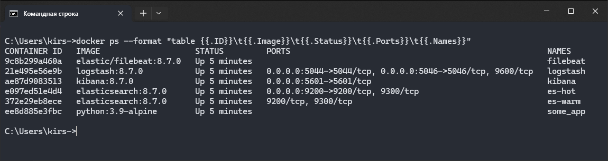
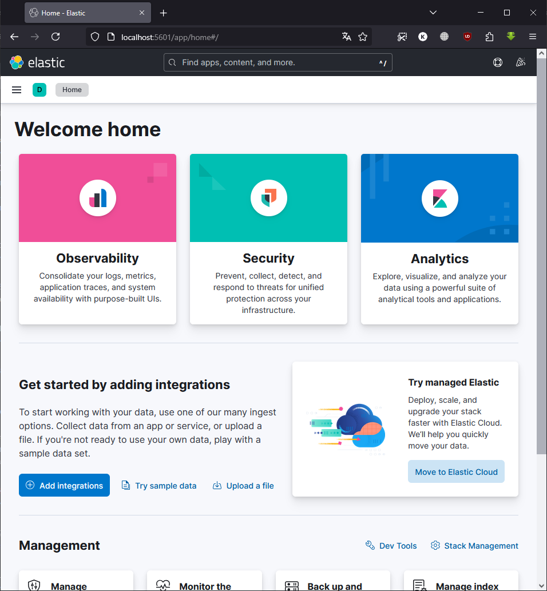
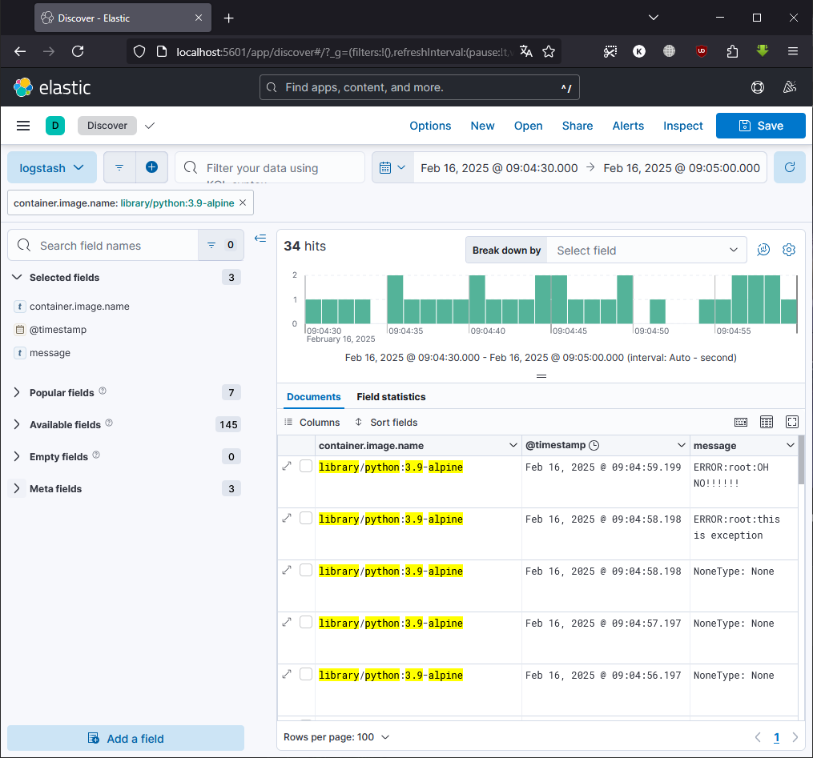

# Домашнее задание к занятию 15 «Система сбора логов Elastic Stack»

### Задание 1

Для выполнения использовалась директория `help`

`docker ps`

`Kibana homepage`

## Задание 2

Просмотр логов удобно настраивается по нужным полям (в моем случае это `container.image.name`, `@timestamp` и `message`) и фильтруется по интересующим значениям.

