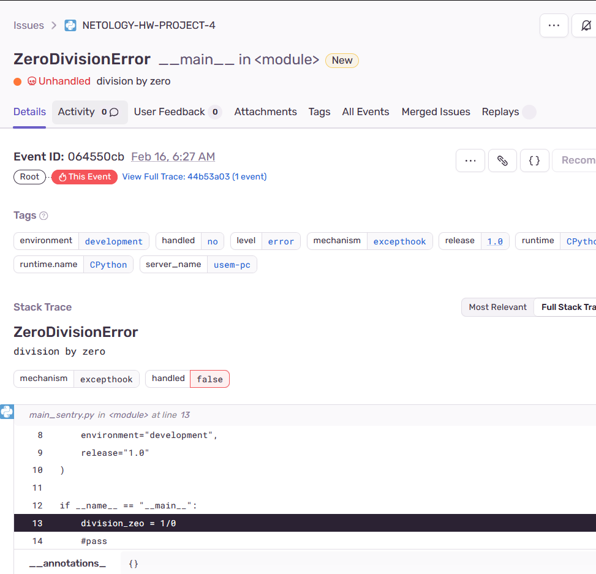

# Домашнее задание к занятию 16 «Платформа мониторинга Sentry»

### Задание 1

Развернул self-hosted Sentry

Панель Projects

### Задание 2

`Stack trace`

`Resolved`

### Задание 3

Т.к. у меня self-hosted версия Sentry, и почта не настроена, я добавил плагин оповещений [через Телеграм](https://github.com/butorov/sentry-telegram) и настроил алерты через телеграм бота.

Почему-то оповещения через тестовое событие не уходят при повторном открытии события, поэтому спровоцировал новое событие с помощью python-скрипта из урока.

