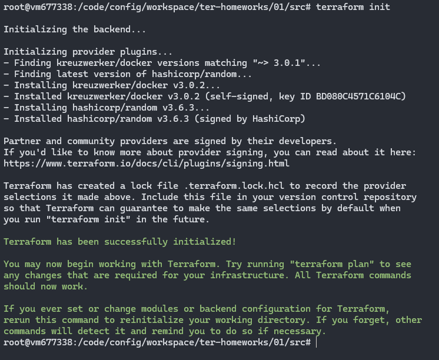
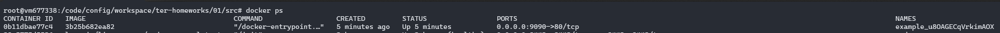

# Решение домашнего задания к занятию «Введение в Terraform»

## Задание 1

1. `A:` Перейдите в каталог src. Скачайте все необходимые зависимости, использованные в проекте.

    `Q:`

    

2. `A:` Изучите файл .gitignore. В каком terraform-файле, согласно этому .gitignore, допустимо сохранить личную, секретную информацию?(логины,пароли,ключи,токены итд)

    `Q:` По-хорошему нельзя хранить важные данные в репозиториях и тем более в открытом виде.
    Но из того, что я вижу, файлы `.tfstate` игнорируются при загрузке в репозиторий, так что, в теории, можно хранить там.

3. `A:` Выполните код проекта. Найдите в state-файле секретное содержимое созданного ресурса random_password, пришлите в качестве ответа конкретный ключ и его значение.

    `Q:` Я не придумал как вывести конкретное значение переменной через terraform без добавления `output` в `main.tf`, так что приложу выводд `cat` через `jq`. Значение хранится по пути `resources.instances.attributes.result`
    ```
    @vm677338:/code/config/workspace/ter-homeworks/01/src# cat ./terraform.tfstate | jq .resources[0].instances[0].attributes.result
    
    "u8OAGECqVrkimAOX"
    ```

4. `A:` Раскомментируйте блок кода, примерно расположенный на строчках 29–42 файла main.tf. Выполните команду terraform validate. Объясните, в чём заключаются намеренно допущенные ошибки. Исправьте их.

    `Q:`
    1. Не указано имя ресурса после `"docker image"`, ведь все блоки ресурсов должны иметь 2 метки (тип и имя).
    2. Имя может начинаться с буквы или символа подчеркивания, но не с цифры.
    3. В строке `name  = "example_${random_password.random_string_FAKE.resulT}"` указаны параметр `FAKE`, которого нет в стандартном модуле и параметр `resulT` должен быть написан в нижнем регистре.

5. `A:` Выполните код. В качестве ответа приложите: исправленный фрагмент кода и вывод команды `docker ps`.

    `Q:`
    ```
    resource "docker_image" "nginx"{
      name         = "nginx:latest"
      keep_locally = true
    }

    resource "docker_container" "nginx" {
      image = docker_image.nginx.image_id
      name  = "example_${random_password.random_string.result}"

      ports {
        internal = 80
        external = 9090
      }
    }
    ```

    

6. `A:` Замените имя docker-контейнера в блоке кода на ```hello_world```. Не перепутайте имя контейнера и имя образа. Мы всё ещё продолжаем использовать name = "nginx:latest". Выполните команду ```terraform apply -auto-approve```.
Объясните своими словами, в чём может быть опасность применения ключа  ```-auto-approve```. Догадайтесь или нагуглите зачем может пригодиться данный ключ? В качестве ответа дополнительно приложите вывод команды ```docker ps```.

    `Q:` При использовании ключа `-auto-approve` пропускается подтверждение пользователем применения конфигурации, а это может быть весьма опасно при ошибке составления файла. С другой стороны, использование этого ключа необходимо, например, в тестовом контуре CI/CD систем, где нет интерактивного режима и конфигурация должна применяться автоматически.

    

7. `A:` Уничтожьте созданные ресурсы с помощью **terraform**. Убедитесь, что все ресурсы удалены. Приложите содержимое файла **terraform.tfstate**. 

    `Q:` Содержимое `terraform.tfstate`
    ```
    {
      "version": 4,
      "terraform_version": "1.8.4",
      "serial": 30,
      "lineage": "dfefa502-934d-b22d-8eb4-b09f2c219a28",
      "outputs": {},
      "resources": [],
      "check_results": null
    }
    ```

8. `A:` Объясните, почему при этом не был удалён docker-образ **nginx:latest**. Ответ **ОБЯЗАТЕЛЬНО НАЙДИТЕ В ПРЕДОСТАВЛЕННОМ КОДЕ**, а затем **ОБЯЗАТЕЛЬНО ПОДКРЕПИТЕ** строчкой из документации [**terraform провайдера docker**](https://docs.comcloud.xyz/providers/kreuzwerker/docker/latest/docs).  (ищите в классификаторе resource docker_image )

    `Q:` В разделе `resource "docker_image" "nginx"` указан параметр `keep_locally = true`, в этом случае dpcker-образ сохраняется после уничтожения ресурса.

    [Из документации](https://docs.comcloud.xyz/providers/kreuzwerker/docker/latest/docs/resources/image#keep_locally):

       keep_locally (Boolean) If true, then the Docker image won't be deleted on destroy operation. If this is false, it will delete the image from the docker local storage on destroy operation.

