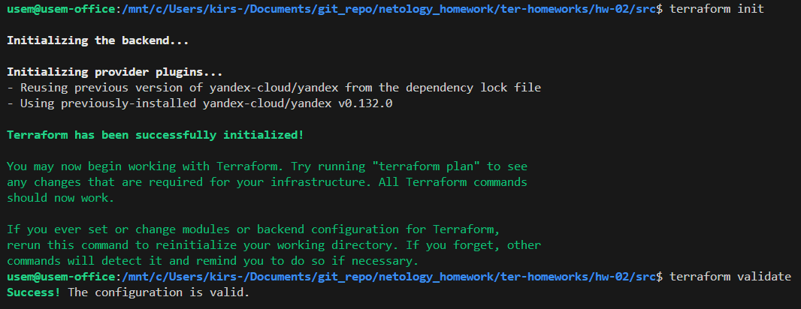
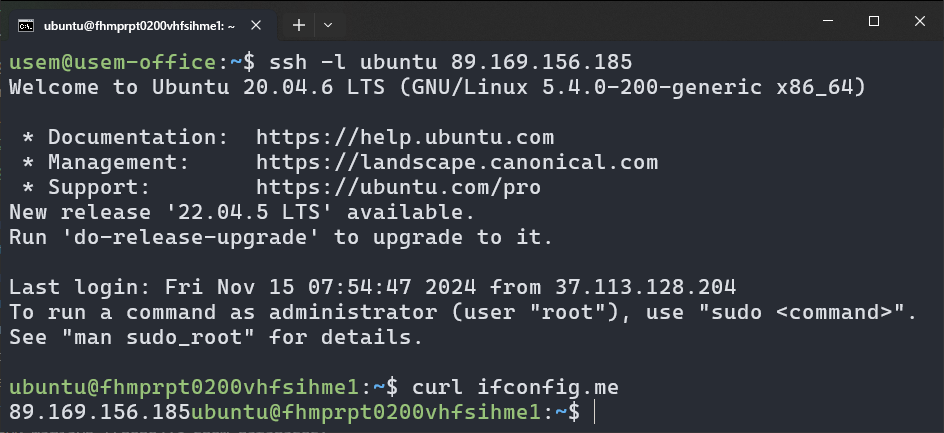
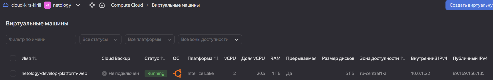
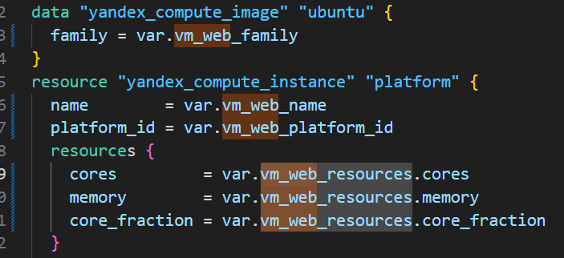
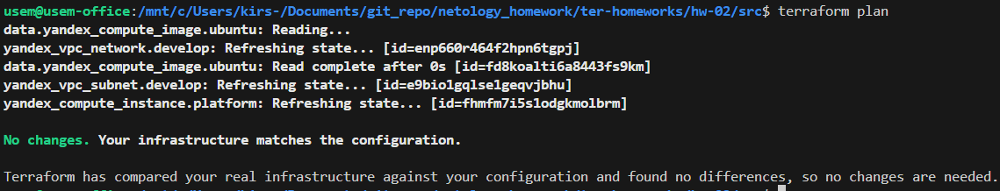
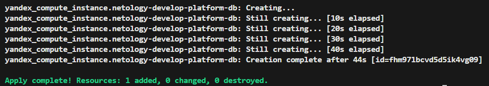
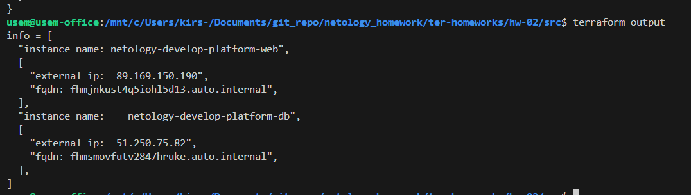

# Решение домашнего задания к занятию «Основы Terraform. Yandex Cloud»

[Ссылка на задание](https://github.com/netology-code/ter-homeworks/blob/main/02/hw-02.md)
## Задание 1

`П.4` - при валидации конфигурации ошибок не выдает. При запуске проекта он просит указать переменные из раздела cloud_vars файла variables, но я не думаю что это ошибка.

Но при создании машины мне сообщили что `"standart-v4"` для `platform_id` не существует. Я использовал `"standard-v3"`, в соответсвии с [таблицей](https://yandex.cloud/en/docs/compute/concepts/performance-levels). `core_fraction` указал 20, т.к. значение должно быть в процентах.

## Задание 2

## Задание 3

Тут в качестве решения, наверное, должа быть [ссылка на файл vms_platform.tf](./src/vms_platform.tf)

## Задание 4

[Ссылка на outputs.tf](./src/outputs.tf)

## Задание 5
