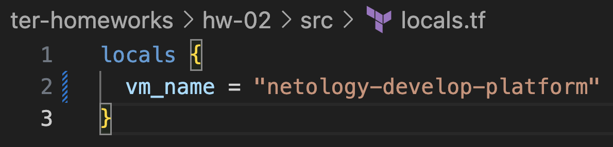
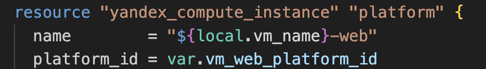
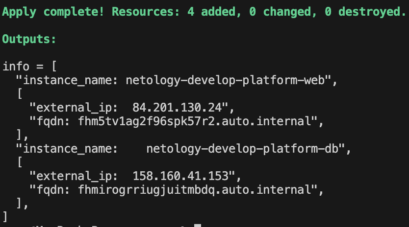
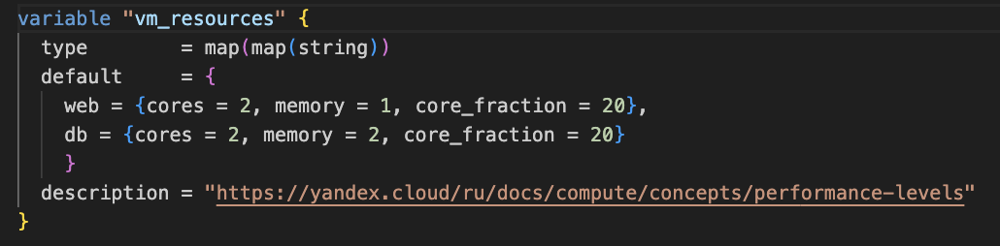
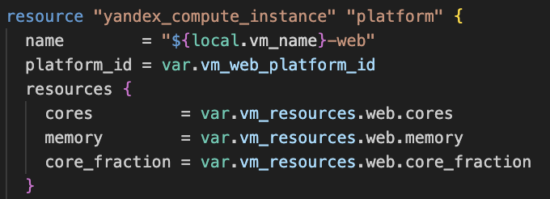
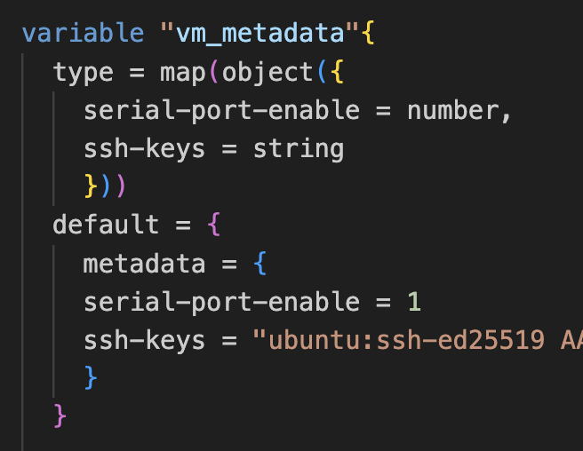
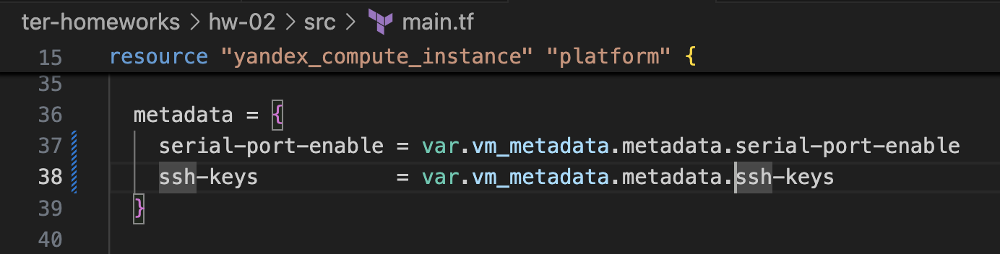
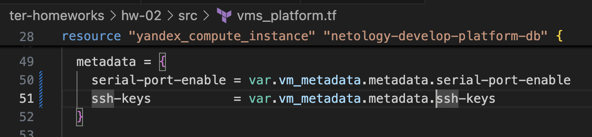
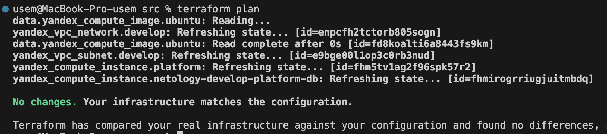

# Решение домашнего задания к занятию «Основы Terraform. Yandex Cloud»


[Ссылка на задание](https://github.com/netology-code/ter-homeworks/blob/main/02/hw-02.md)
## Задание 1

`П.4` - при валидации конфигурации ошибок не выдает. При запуске проекта он просит указать переменные из раздела cloud_vars файла variables, но я не думаю что это ошибка.


Но при создании машины мне сообщили что `"standart-v4"` для `platform_id` не существует. Я использовал `"standard-v3"`, в соответсвии с [таблицей](https://yandex.cloud/en/docs/compute/concepts/performance-levels). `core_fraction` указал 20, т.к. значение должно быть в процентах.


## Задание 2


## Задание 3

Тут в качестве решения, наверное, должа быть [ссылка на файл vms_platform.tf](./src/vms_platform.tf)


## Задание 4

[Ссылка на outputs.tf](./src/outputs.tf)


## Задание 5







## Задание 6

 1. 
 
 

 2. 

 
 
 
 

## Задание 7*

1. ```
    > local.test_list[1]
    "staging"
    ```
2.  ```
    > length(local.test_list)
    3
    ```
3.  ```
    > local.test_map["admin"]
    "John"
    ```
4. ```
    > "${local.test_map["admin"]} is ${keys(local.test_map)[0]} for ${local.test_list[2]} server based on OS ${local.servers.production.image} with ${local.servers.production.cpu} v${keys(local.servers.production)[0]},${local.servers.production.ram} ${keys(local.servers.production)[3]} and ${length(local.servers.production.disks)} virtual ${keys(local.servers.production)[1]}"
    
    "John is admin for production server based on OS ubuntu-20-04 with 10 vcpu,40 ram and 4 virtual disks"
    ```
