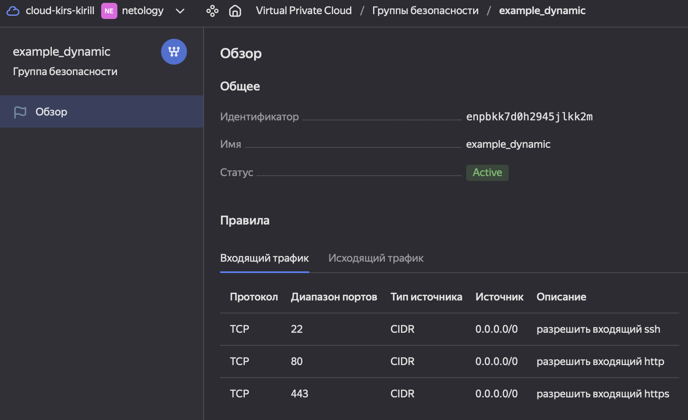
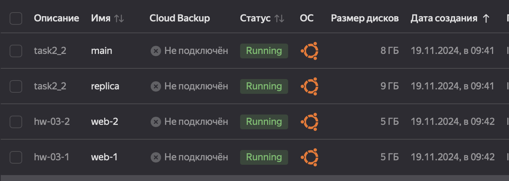
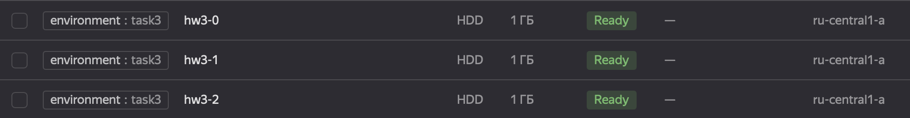
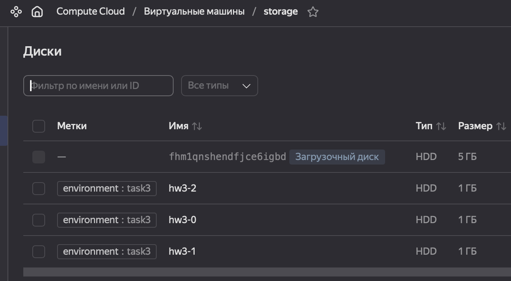
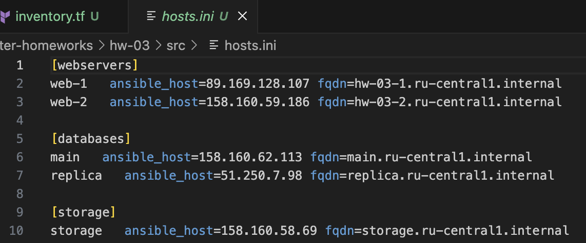
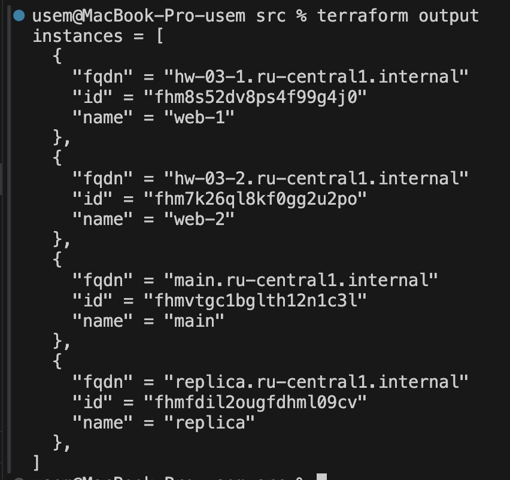

# Решение домашнего задания к занятию «Управляющие конструкции в коде Terraform»

[Ссылка на задание](https://github.com/netology-code/ter-homeworks/blob/main/03/hw-03.md)

## Задание 1

Правила групп безопасности создаются корректно.



> [!NOTE]
> В терминале эти правила можно просмотреть командами
> ```
> yc vpc security-group list
> yc vpc security-group get --name <name>
> ```

<details>
    <summary>Пример</summary>

    % yc vpc security-group list                      
    +----------------------+---------------------------------+--------------------------------+----------------------+
    |          ID          |              NAME               |          DESCRIPTION           |      NETWORK-ID      |
    +----------------------+---------------------------------+--------------------------------+----------------------+
    | enpbkk7d0h2945jlkk2m | example_dynamic                 |                                | enp5jk7ie776m78uob29 |
    | enpfbdh2ntcve39krrjr | default-sg-enp5jk7ie776m78uob29 | Default security group for     | enp5jk7ie776m78uob29 |
    |                      |                                 | network                        |                      |
    +----------------------+---------------------------------+--------------------------------+----------------------+

    % yc vpc security-group get --name example_dynamic
    id: enpbkk7d0h2945jlkk2m
    folder_id: b1g65ggbv0fmdj4bp782
    created_at: "2024-11-17T14:30:57Z"
    name: example_dynamic
    network_id: enp5jk7ie776m78uob29
    status: ACTIVE
    rules:
      - id: enplq065d60cqd45mgaj
        description: разрешить весь исходящий трафик
        direction: EGRESS
        ports:
          to_port: "65365"
        protocol_name: TCP
        protocol_number: "6"
        cidr_blocks:
          v4_cidr_blocks:
            - 0.0.0.0/0
      - id: enpam900l6pgppnfgpnp
        description: разрешить входящий ssh
        direction: INGRESS
        ports:
          from_port: "22"
          to_port: "22"
        protocol_name: TCP
        protocol_number: "6"
        cidr_blocks:
          v4_cidr_blocks:
            - 0.0.0.0/0
      - id: enp35aacjqdtpctund4e
        description: разрешить входящий  http
        direction: INGRESS
        ports:
          from_port: "80"
          to_port: "80"
        protocol_name: TCP
        protocol_number: "6"
        cidr_blocks:
          v4_cidr_blocks:
            - 0.0.0.0/0
      - id: enpdo5cuugjna6feja8i
        description: разрешить входящий https
        direction: INGRESS
        ports:
          from_port: "443"
          to_port: "443"
        protocol_name: TCP
        protocol_number: "6"
        cidr_blocks:
          v4_cidr_blocks:
            - 0.0.0.0/0
</details>


## Задание 2

[count-vm.tf](./src/count-vm.tf)

[for_each-vm.tf](./src/for_each-vm.tf)


Не совсем понял что должна делать переменная `disk_volume` из задания, поэтому назначил ей значение размера диска.

[variables.tf](./src/variables.tf)

На скриншоте показаны имена машин, размеры дисков и время создания (машины из 2.1 созданы после 2.2)


## Задание 3
1.  


2.



## Задание 4



[Ссылка на коммит](https://github.com/kirs-kirill/netology_homework/commit/47c4178143a92da789aa7bc701f5193efd713a68)

## Задание 5*


